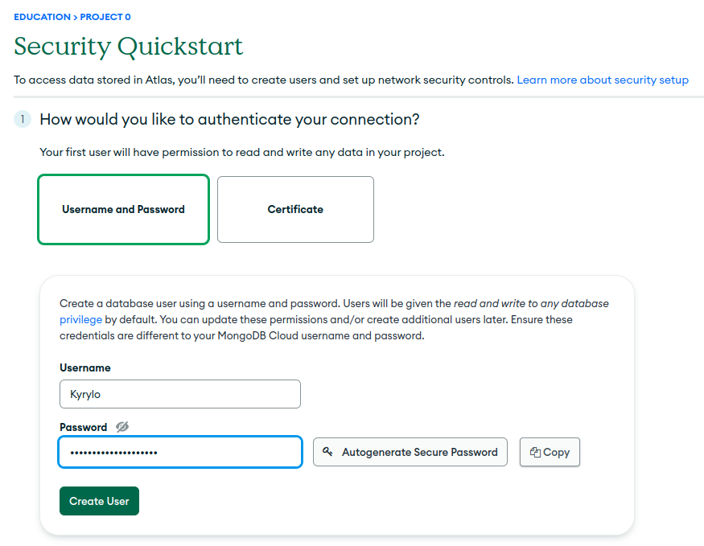
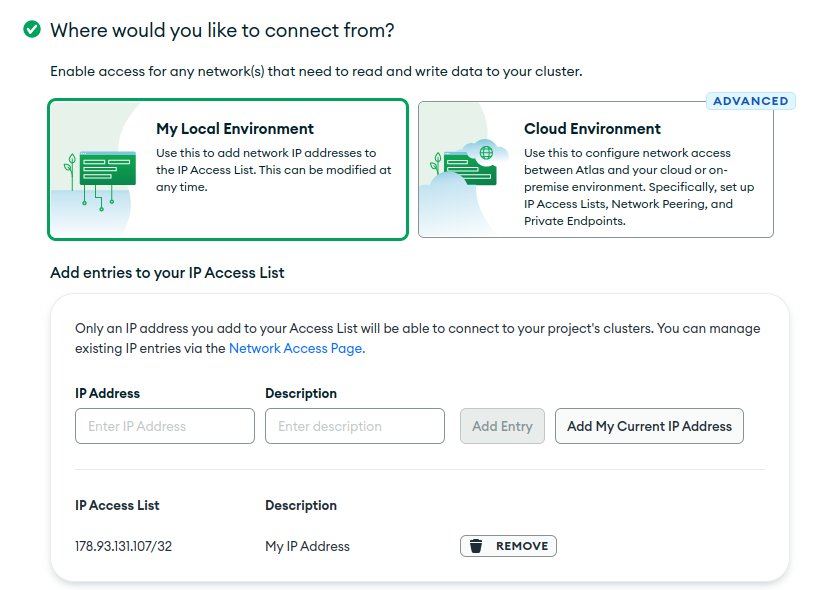
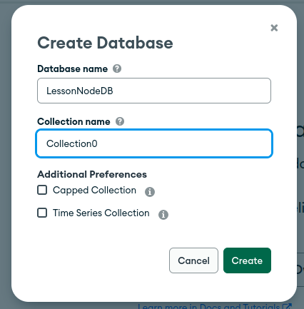
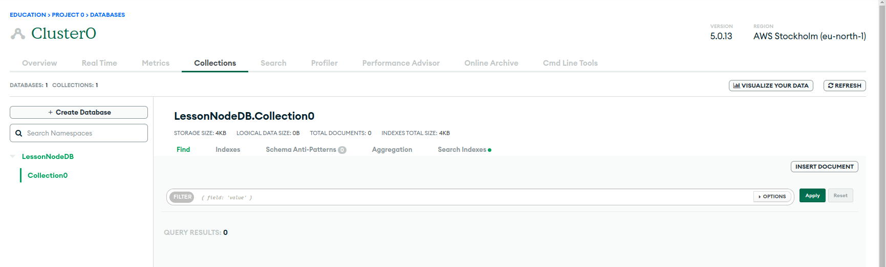
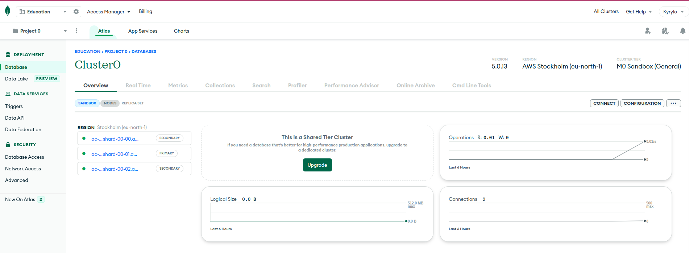
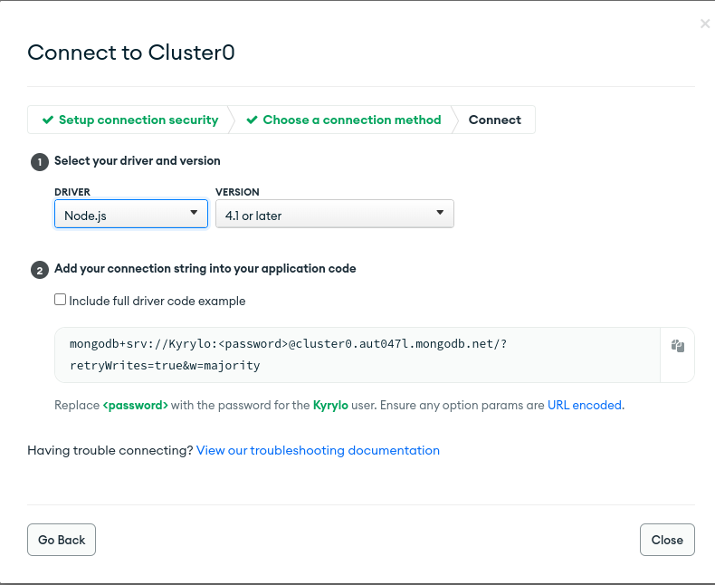

# Mongo

**MongoDB** — <mark style="color:blue;">документо-орієнтована система керування базами даних</mark> (СКБД) з <mark style="color:blue;">відкритим вихідним кодом</mark>, яка не потребує опису схеми таблиць. MongoDB займає нішу між швидкими і масштабованими системами, що оперують даними у форматі ключ/значення, і <mark style="color:blue;">реляційними СКБД</mark>, функціональними і зручними у формуванні запитів.

<mark style="color:blue;">Код</mark> MongoDB написаний на мові <mark style="color:blue;">C++</mark> і поширюється в рамках ліцензії <mark style="color:blue;">AGPLv</mark>3.

MongoDB підтримує зберігання документів в <mark style="color:blue;">JSON</mark>-подібному форматі, має досить гнучку мову для формування запитів, може створювати індекси для різних збережених атрибутів, ефективно забезпечує зберігання великих бінарних об'єктів, підтримує <mark style="color:blue;">журналювання</mark> операцій зі зміни і додавання даних в БД, може працювати відповідно до парадигми Map/Reduce, підтримує реплікацію і побудову відмовостійких конфігурацій. У MongoDB є вбудовані засоби із забезпечення шардінгу (розподіл набору даних по серверах на основі певного ключа), комбінуючи який з реплікацією даних можна побудувати горизонтально масштабований кластер зберігання, в якому відсутня єдина точка відмови (збій будь-якого вузла не позначається на роботі БД), підтримується автоматичне відновлення після збою і перенесення навантаження з вузла, який вийшов з ладу. Розширення кластера або перетворення одного сервера на кластер проводиться без зупинки роботи БД простим додаванням нових машин.

### Як MongoDB зберігає дані?

Перш ніж йти далі, давайте трохи розберемося, як дані зберігаються в MongoDB.

MongoDB зберігає дані в [документи BSON](https://docs.mongodb.com/manual/core/document/).&#x20;

BSON — це двійкове представлення документів JSON (JavaScript Object Notation). Коли ви читаєте документацію MongoDB, ви часто побачите термін [документ](https://docs.mongodb.com/manual/reference/glossary/#term-document), але ви можете розглядати документ як просто об’єкт JavaScript.

Документ можете розглядати як приблизно еквівалентний рядку в реляційних бд.


MongoDB зберігає групи документів у колекції. Можна вважати колекцію приблизно еквівалентною таблиці.


Кожен документ повинен мати поле з іменем `_id`. Значення `_id` має бути унікальним для кожного документа в колекції, є незмінним і може бути будь-якого типу, крім масиву. MongoDB автоматично створить індекс на `_id`. Ви можете зробити значення `_id` значущим (а не дещо випадковим).

[**ObjectId**](https://docs.mongodb.com/manual/reference/bson-types/#objectid) **-** унікальне значення для кожного документа, який ви хочете мати можливість швидкого пошуку.&#x20;

Давайте поглянемо на прикладі документа BSON:


```javascript
{
_id: new ObjectId("63527a3ff675945843e1064c")      
title: 'Titanic',
     year: 1997,
     genres: [ 'Drama', 'Romance' ],
     rated: 'PG-13',
     languages: [ 'English', 'French', 'German', 'Swedish', 'Italian', 'Russian' ],
     released: ISODate("1997-12-19T00:00:00.000Z"),
     awards: {
        wins: 127,
        nominations: 63,
        text: 'Won 11 Oscars. Another 116 wins & 63 nominations.'
     },
     cast: [ 'Leonardo DiCaprio', 'Kate Winslet', 'Billy Zane', 'Kathy Bates' ],
     directors: [ 'James Cameron' ]
  }
```


Додаткову інформацію про [MongoDB](https://www.mongodb.com/docs/) можна прочитати в офіційній документації.

### **Встановлення бази даних MongoDB**

Саме перше, що ми повинні зробити - встановити базу даних MongoDb, в якій будуть зберігатися дані нашої бібліотеки.\
Існує багато способів використання баз даних:

1. Локально за допомогою документацій [MongoDb](https://www.mongodb.com/docs/manual/installation/) (це не важче як встановити node.js)**;**
2. Використати [**docker**](https://www.docker.com/get-started/). За допомогою docker можна встановити не тільки MongoDb а й багато іншого (рекомендую для вивчення);
3. Скористатись Cloud server (AWS, Google…);
4. Atlas cloud-hosted sandbox database (хмарну базу даних пісочниці MongoDB Atlas).

В навчанні ми будемо використовувати використовувати хмарну базу даних пісочниці [**MongoDB Atlas**](https://www.mongodb.com/atlas/database).


Цей рівень бази даних не вважається придатним для робочих веб-сайтів, оскільки він не має надмірності, але він чудово підходить для розробки та створення прототипів.


Ми використовуємо його тут, оскільки він безкоштовний і простий у налаштуванні, а також тому, що MongoDB Atlas є популярною базою даних як постачальник послуг, якого ви можете розумно вибрати для своєї робочої бази даних (інші популярні варіанти на момент написання включають [**Compose**](https://www.compose.com/) , [**ScaleGrid**](https://scalegrid.io/pricing.html) і [**ObjectRocket**](https://www.objectrocket.com/) ).


Примітка. За бажанням ви можете налаштувати базу даних MongoDb локально, завантаживши та встановивши [**відповідні двійкові файли для вашої системи**](https://www.mongodb.com/download-center/community/releases). Решта інструкцій у цій статті будуть подібними, за винятком URL-адреси бази даних, яку ви вказуєте під час підключення. Зверніть увагу, однак, що [**підручник Express Tutorial Part 7: Deploying to Production**](https://developer.mozilla.org/en-US/docs/Learn/Server-side/Express\_Nodejs/deployment) вимагає певної форми віддаленої бази даних, оскільки безкоштовний рівень служби [**Heroku**](https://www.heroku.com/) не забезпечує постійного зберігання. Тому настійно рекомендується використовувати [**MongoDB Atlas**](https://www.mongodb.com/atlas/database) .


Спершу вам потрібно буде [create an account](https://www.mongodb.com/cloud/atlas/register) у MongoDB Atlas (це безкоштовно, і лише потрібно ввести основні контактні дані та прийняти їхні умови обслуговування).\
****

<figure><figcaption><p>Створення акаунту<br></p></figcaption></figure>

<figure><figcaption><p>Додаткові дані реєстрації</p></figcaption></figure>

після введення всіх даних потрібно підтвердити пошту

<figure><figcaption></figcaption></figure>

Після входу ви перейдете на [home](https://cloud.mongodb.com/v2) екран:

1\) Натисніть кнопку « **Build a Database** » у розділі « _Database Deployments_ »&#x20;

<figure><figcaption></figcaption></figure>

2\) Це відкриє екран _Deploy a cloud database._  Натисніть кнопку « **Create** » під параметром       « _Shared_».

<figure><figcaption></figcaption></figure>

3\) __ Відкриється екран _Create a Shared Cluster ._

<figure><figcaption></figcaption></figure>

* Виберіть будь-якого постачальника в розділі _Cloud Provider & Region_ . Різні регіони пропонують різних провайдерів.
* _Cluster Tier_ та _Additional Settings_ змінювати не потрібно. Ви можете змінити назву свого Cluster в розділі _Cluster Name_.  Ми називаємо це `Cluster0`для цього підручника.
* Натисніть кнопку **Create Cluster** (створення кластера займе кілька хвилин).

4\) Відкриється розділ S_ecurity Quickstart_.

<figure><figcaption><p>Створення користувача</p></figcaption></figure>

<figure><figcaption><p>Форма підключення</p></figcaption></figure>

Введіть ім'я користувача та пароль. Не забудьте скопіювати та безпечно зберегти облікові дані, оскільки вони нам знадобляться пізніше. Натисніть кнопку **Create User**.


Уникайте використання спеціальних символів у паролі користувача MongoDB, оскільки mongoose може не аналізувати рядок підключення належним чином.


* Введіть `0.0.0.0/0`у поле IP-адреса. Це повідомляє MongoDB, що ми хочемо дозволити доступ з будь-якого місця. Натисніть кнопку **Add Entry**.


Найкраще обмежити IP-адреси, які можуть підключатися до вашої бази даних та інших ресурсів. Тут ми дозволяємо підключення з будь-якого місця, тому що ми не знаємо, звідки надійде запит після розгортання.


* Натисніть кнопку **Finish і Close**.

5\) Це відкриє наступний екран. Натисніть кнопку **Go to Databases**.

<figure><figcaption></figcaption></figure>

6\) Ви повернетеся до екрана «_Database Deployments »._ Натисніть кнопку **Add My Own Data** .\


<figure><figcaption></figcaption></figure>

7\) Відкриється розділ _Collections_. Натисніть кнопку «**Add My Own Data**».

<figure><figcaption></figcaption></figure>

8\) Це відкриє екран _Create Database._

<figure><figcaption></figcaption></figure>

* Введіть назву для нової бази даних як `local_library`.
* Введіть назву колекції як `Collection0`.
* Натисніть кнопку **Create**, щоб створити базу даних.

9\) Ви повернетеся до екрана _Collections_ зі створеною базою даних_._

<figure><figcaption></figcaption></figure>

* Натисніть вкладку «_Overview_»,  щоб повернутися до огляду кластера.

10\) На екрані огляду _Cluster0_ натисніть кнопку **Connect**.

<figure><figcaption></figcaption></figure>

11\) Відкриється екран _Connect to Cluster._ Натисніть опцію «**Connect your application**».

<figure><figcaption></figcaption></figure>

12\) Тепер вам буде показано екран _Connect to Cluster0._

<figure><figcaption></figcaption></figure>

* Натисніть піктограму **Copy**, щоб скопіювати рядок підключення.
* Вставте це у свій локальний текстовий редактор.
* Оновіть пароль своїм паролем користувача.
* Замінити `myFirstDatabase`на `local_library`.
* Збережіть файл, що містить цей рядок, у безпечному місці.

Тепер ви створили базу даних і маєте URL-адресу (з іменем користувача та паролем), яку можна використовувати для доступу до неї. Це буде виглядати приблизно так: `mongodb+srv://Kyrylo:@cluster0.aut047l.mongodb.net/?retryWrites=true&w=majority`

## Перше підключення

Для тестування бд використайте наступний код


```javascript
const { MongoClient } = require("mongodb");
const username = encodeURIComponent("Name");
const password = encodeURIComponent("Password");
const cluster = "cluster0.aut047l.mongodb.net";

let uri =
    `mongodb+srv://${username}:${password}@${cluster}/?retryWrites=true&w=majority`;
const client = new MongoClient(uri);
async function testMongoConnection() {
    try {
        await client.connect();
        const database = client.db("LessonNodeDB");
        const ratings = database.collection("Collection0");
        const cursor = ratings.find();
        console.log(ratings)
        await cursor.forEach(doc => console.log(doc));

    } finally {
        await client.close();
    }
}
module.exports = testMongoConnection;

```



Не кодуйте спеціальні символи у своєму паролі, якщо ви використовуєте свій пароль за межами URI рядка підключення (наприклад, вставляючи його в[`mongosh`](https://www.mongodb.com/docs/mongodb-shell/#mongodb-binary-bin.mongosh)).


В майбутньому ми будемо використовувати бібліотеку Mongoose

### Встановіть Mongoose <a href="#install_mongoose" id="install_mongoose"></a>

Відкрийте командний рядок і перейдіть до каталогу, де ви створили скелет веб-сайту локальної бібліотеки . Введіть таку команду, щоб установити `Mongoose` (і його залежності) і додати її до свого файлу **`package.json.`**


```bash
npm install mongoose
```


### [Підключіться до MongoDB](https://developer.mozilla.org/en-US/docs/Learn/Server-side/Express\_Nodejs/mongoose#connect\_to\_mongodb) <a href="#connect_to_mongodb" id="connect_to_mongodb"></a>

Відкрийте **/app.js** (у кореневій папці вашого проекту) і скопіюйте наведений нижче текст, де ви оголошуєте _об’єкт програми Express_ (після рядка `const app = express();`). Замініть рядок URL-адреси бази даних (' _insert\_your\_database\_url\_here_ ') на URL-адресу розташування, яка представляє вашу власну базу даних (тобто використовуючи інформацію з _mongoDB Atlas_ ).


```javascript
// Import the mongoose module
const mongoose = require("mongoose");

// Set up default mongoose connection
const mongoDB = "mongodb://127.0.0.1/my_database";
mongoose.connect(mongoDB, { useNewUrlParser: true, useUnifiedTopology: true });

// Get the default connection
const db = mongoose.connection;

// Bind connection to error event (to get notification of connection errors)
db.on("error", console.error.bind(console, "MongoDB connection error:"));
```


Цей код створює типове з’єднання з базою даних і прив’язується до події помилки (таким чином помилки будуть виведені на консоль).

Ви можете отримати `Connection`об’єкт за замовчуванням за допомогою `mongoose.connection`. `Connection`Після підключення в екземплярі запускається подія open .


Якщо вам потрібно створити додаткові підключення, ви можете використовувати `mongoose.createConnection()`. Це приймає ту саму форму URI бази даних (з хостом, базою даних, портом, параметрами тощо), як `connect()`і повертає `Connection`об’єкт).


## Визначення та створення моделей <a href="#defining_and_creating_models" id="defining_and_creating_models"></a>

Наведений нижче фрагмент коду показує, як можна визначити просту схему. Спочатку ви `require()`мангуст, а потім використовуєте конструктор Schema, щоб створити новий екземпляр схеми, визначаючи різні поля всередині нього в параметрі об’єкта конструктора.

\



```javascript
// Require Mongoose
const mongoose = require("mongoose");

// Define a schema
const Schema = mongoose.Schema;

const SomeModelSchema = new Schema({
  a_string: String,
  a_date: Date,
});

```


У наведеному вище випадку ми маємо лише два поля, рядок і дату. У наступних розділах ми покажемо деякі інші типи полів, перевірку та інші методи.

### **Створення моделі**

Моделі створюються зі схем за допомогою `mongoose.model()`методу:


```javascript
// Define schema
const Schema = mongoose.Schema;

const SomeModelSchema = new Schema({
  a_string: String,
  a_date: Date,
});

// Compile model from schema
const SomeModel = mongoose.model("SomeModel", SomeModelSchema);
```


Перший аргумент — це однина назви колекції, яка буде створена в моделі (Mongoose створить колекцію бази даних для наведеної вище моделі _SomeModel_ вище), а другий аргумент — це схема, яку ви хочете використовувати для створення моделі.


Визначивши класи моделі, ви можете використовувати їх для створення, оновлення або видалення записів, а також виконувати запити для отримання всіх записів або окремих підмножин записів.


### **Типи схем (поля)**

Схема може мати довільну кількість полів — кожне з них представляє поле в документах, що зберігаються в _MongoDB_ . Нижче наведено приклад схеми, що показує багато загальних типів полів і те, як вони оголошуються.


```javascript
const schema = new Schema({
  name: String,
  binary: Buffer,
  living: Boolean,
  updated: { type: Date, default: Date.now() },
  age: { type: Number, min: 18, max: 65, required: true },
  mixed: Schema.Types.Mixed,
  _someId: Schema.Types.ObjectId,
  array: [],
  ofString: [String], // You can also have an array of each of the other types too.
  nested: { stuff: { type: String, lowercase: true, trim: true } },
});
```


Більшість [SchemaTypes](https://mongoosejs.com/docs/schematypes.html) (дескриптори після "type:" або після імен полів) не потребують пояснень. Винятками є:

* `ObjectId`: представляє конкретні екземпляри моделі в базі даних. Наприклад, книга може використовувати це для представлення об’єкта автора. Це фактично міститиме унікальний ідентифікатор ( `_id`) для вказаного об’єкта. Ми можемо використовувати цей `populate()`метод, щоб за потреби отримати пов’язану інформацію.
* [`Mixed`](https://mongoosejs.com/docs/schematypes.html#mixed): довільний тип схеми.
* `[]`: масив елементів. Над цими моделями можна виконувати операції з масивами JavaScript (push, pop, unshift тощо). У наведених вище прикладах показано масив об’єктів без указаного типу та масив `String`об’єктів, але ви можете мати масив об’єктів будь-якого типу.

Код також показує обидва способи оголошення поля:

* _Ім’я_ та _тип_ поля як пара ключ-значення (тобто як це робиться з полями `name`, `binary`та `living`).
* _Ім’я_ поля з об’єктом, що визначає `type`, та будь-які інші _параметри_ поля. Варіанти включають такі речі, як:
  * значення за замовчуванням.
  * вбудовані валідатори (наприклад, максимальні/мінімальні значення) і спеціальні функції перевірки.
  * Чи обов’язкове поле
  * Чи `String`мають поля автоматично встановлюватися на нижній, верхній регістр або обрізані (наприклад, `{ type: String, lowercase: true, trim: true }`)

Щоб отримати додаткові відомості про параметри, перегляньте [SchemaTypes](https://mongoosejs.com/docs/schematypes.html) (документи Mongoose).

### **Перевірка**

Mongoose надає вбудовані та спеціальні валідатори, а також синхронні та асинхронні валідатори. Це дозволяє вказати як прийнятний діапазон значень, так і повідомлення про помилку для помилки перевірки в усіх випадках.

Вбудовані валідатори включають:

* Усі [SchemaType](https://mongoosejs.com/docs/schematypes.html) мають вбудований [необхідний](https://mongoosejs.com/docs/api.html#schematype\_SchemaType-required) валідатор. Це використовується для визначення того, чи потрібно заповнювати поле для збереження документа.
* [Числа](https://mongoosejs.com/docs/api.html#schema-number-js) мають валідатори [min](https://mongoosejs.com/docs/api.html#schema\_number\_SchemaNumber-min) і [max .](https://mongoosejs.com/docs/api.html#schema\_number\_SchemaNumber-max)
* [Рядки](https://mongoosejs.com/docs/api.html#schema-string-js) мають:
  * [enum](https://mongoosejs.com/docs/api.html#schema\_string\_SchemaString-enum) : визначає набір дозволених значень для поля.
  * [match](https://mongoosejs.com/docs/api.html#schema\_string\_SchemaString-match) : визначає регулярний вираз, якому має відповідати рядок.
  * [maxLength](https://mongoosejs.com/docs/api.html#schema\_string\_SchemaString-maxlength) і [minLength](https://mongoosejs.com/docs/api.html#schema\_string\_SchemaString-minlength) для рядка.

Наведений нижче приклад (дещо змінений на основі документів Mongoose) показує, як можна вказати деякі типи валідаторів і повідомлення про помилки:


```javascript
const breakfastSchema = new Schema({
  eggs: {
    type: Number,
    min: [6, "Too few eggs"],
    max: 12,
    required: [true, "Why no eggs?"],
  },
  drink: {
    type: String,
    enum: ["Coffee", "Tea", "Water"],
  },
});
```


Щоб отримати повну інформацію про перевірку полів, перегляньте [перевірку](https://mongoosejs.com/docs/validation.html) (документи Mongoose).

### **Віртуальні властивості**

Віртуальні властивості — це властивості документа, які ви можете отримати та встановити, але які не зберігаються в MongoDB. Геттери корисні для форматування або об’єднання полів, тоді як сетери корисні для декомпозиції одного значення на кілька значень для зберігання. У прикладі в документації створюється (і деконструюється) віртуальна властивість повного імені з полів імені та прізвища, що простіше та чистіше, ніж конструювати повне ім’я кожного разу, коли воно використовується в шаблоні.


**В**іртуальна властивість у бібліотеці, щоб визначити унікальну URL-адресу для кожного запису моделі за допомогою шляху та значення запису `_id`.


Для отримання додаткової інформації див. [Віртуальні](https://mongoosejs.com/docs/guide.html#virtuals) (документація Mongoose).

### **Методи та помічники запитів**

Схема також може мати [методи екземплярів](https://mongoosejs.com/docs/guide.html#methods) , [статичні методи](https://mongoosejs.com/docs/guide.html#statics) та [помічники запитів](https://mongoosejs.com/docs/guide.html#query-helpers) . Метод екземпляра та статичний методи схожі, але з тією очевидною різницею, що метод екземпляра пов’язаний із певним записом і має доступ до поточного об’єкта. Помічники запитів дозволяють вам розширити [API конструктора ланцюжкових запитів](https://mongoosejs.com/docs/queries.html) mongoose (наприклад, дозволяючи додавати запит "byName" на додаток до методів `find()`, `findOne()`і ).`findById()`

### Використання моделей <a href="#using_models" id="using_models"></a>

Модель представляє набір документів у базі даних, за якими можна шукати, тоді як екземпляри моделі представляють окремі документи, які можна зберігати та отримувати.

Для отримання додаткової інформації див.: [Моделі](https://mongoosejs.com/docs/models.html) (документи Mongoose).

### **Створення та редагування документів**
