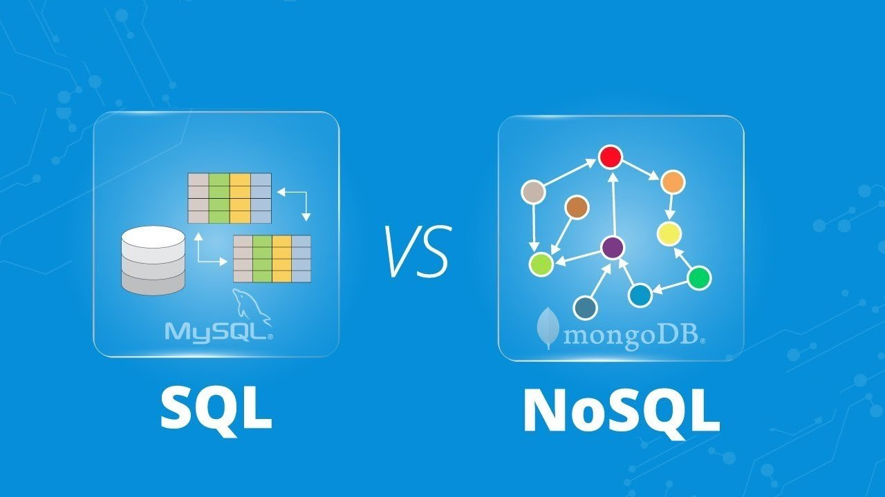

# Mongo

**MongoDB** — <mark style="color:blue;">документо-орієнтована система керування базами даних</mark> (СКБД) з <mark style="color:blue;">відкритим вихідним кодом</mark>, яка не потребує опису схеми таблиць. MongoDB займає нішу між швидкими і масштабованими системами, що оперують даними у форматі ключ/значення, і <mark style="color:blue;">реляційними СКБД</mark>, функціональними і зручними у формуванні запитів.

<mark style="color:blue;">Код</mark> MongoDB написаний на мові <mark style="color:blue;">C++</mark> і поширюється в рамках ліцензії <mark style="color:blue;">AGPLv</mark>3.

MongoDB підтримує зберігання документів в <mark style="color:blue;">JSON</mark>-подібному форматі, має досить гнучку мову для формування запитів, може створювати індекси для різних збережених атрибутів, ефективно забезпечує зберігання великих бінарних об'єктів, підтримує <mark style="color:blue;">журналювання</mark> операцій зі зміни і додавання даних в БД, може працювати відповідно до парадигми Map/Reduce, підтримує реплікацію і побудову відмовостійких конфігурацій. У MongoDB є вбудовані засоби із забезпечення шардінгу (розподіл набору даних по серверах на основі певного ключа), комбінуючи який з реплікацією даних можна побудувати горизонтально масштабований кластер зберігання, в якому відсутня єдина точка відмови (збій будь-якого вузла не позначається на роботі БД), підтримується автоматичне відновлення після збою і перенесення навантаження з вузла, який вийшов з ладу. Розширення кластера або перетворення одного сервера на кластер проводиться без зупинки роботи БД простим додаванням нових машин.

### Як MongoDB зберігає дані?

Перш ніж йти далі, давайте трохи розберемося, як дані зберігаються в MongoDB.

MongoDB зберігає дані в [документи BSON](https://docs.mongodb.com/manual/core/document/).&#x20;

BSON — це двійкове представлення документів JSON (JavaScript Object Notation). Коли ви читаєте документацію MongoDB, ви часто побачите термін [документ](https://docs.mongodb.com/manual/reference/glossary/#term-document), але ви можете розглядати документ як просто об’єкт JavaScript.

Документ можете розглядати як приблизно еквівалентний рядку в реляційних бд.


MongoDB зберігає групи документів у колекції. Можна вважати колекцію приблизно еквівалентною таблиці.


Кожен документ повинен мати поле з іменем `_id`. Значення `_id` має бути унікальним для кожного документа в колекції, є незмінним і може бути будь-якого типу, крім масиву. MongoDB автоматично створить індекс на `_id`. Ви можете зробити значення `_id` значущим (а не дещо випадковим).

[**ObjectId**](https://docs.mongodb.com/manual/reference/bson-types/#objectid) **-** унікальне значення для кожного документа, який ви хочете мати можливість швидкого пошуку.&#x20;

Давайте поглянемо на прикладі документа BSON:


```javascript
{
_id: new ObjectId("63527a3ff675945843e1064c")      
title: 'Titanic',
     year: 1997,
     genres: [ 'Drama', 'Romance' ],
     rated: 'PG-13',
     languages: [ 'English', 'French', 'German', 'Swedish', 'Italian', 'Russian' ],
     released: ISODate("1997-12-19T00:00:00.000Z"),
     awards: {
        wins: 127,
        nominations: 63,
        text: 'Won 11 Oscars. Another 116 wins & 63 nominations.'
     },
     cast: [ 'Leonardo DiCaprio', 'Kate Winslet', 'Billy Zane', 'Kathy Bates' ],
     directors: [ 'James Cameron' ]
  }
```


Додаткову інформацію про [MongoDB](https://www.mongodb.com/docs/) можна прочитати в офіційній документації.

### **Встановлення бази даних MongoDB**

Саме перше, що ми повинні зробити - встановити базу даних MongoDb, в якій будуть зберігатися дані нашої бібліотеки.\
Існує багато способів використання баз даних:

1. Локально за допомогою документацій [MongoDb](https://www.mongodb.com/docs/manual/installation/) (це не важче як встановити node.js)**;**
2. Використати [**docker**](https://www.docker.com/get-started/). За допомогою docker можна встановити не тільки MongoDb а й багато іншого (рекомендую для вивчення);
3. Скористатись Cloud server (AWS, Google…);
4. Atlas cloud-hosted sandbox database (хмарну базу даних пісочниці MongoDB Atlas).

В навчанні ми будемо використовувати використовувати хмарну базу даних пісочниці [**MongoDB Atlas**](https://www.mongodb.com/atlas/database).


Цей рівень бази даних не вважається придатним для робочих веб-сайтів, оскільки він не має надмірності, але він чудово підходить для розробки та створення прототипів.


Ми використовуємо його тут, оскільки він безкоштовний і простий у налаштуванні, а також тому, що MongoDB Atlas є популярною базою даних як постачальник послуг, якого ви можете розумно вибрати для своєї робочої бази даних (інші популярні варіанти на момент написання включають [**Compose**](https://www.compose.com/) , [**ScaleGrid**](https://scalegrid.io/pricing.html) і [**ObjectRocket**](https://www.objectrocket.com/) ).


Примітка. За бажанням ви можете налаштувати базу даних MongoDb локально, завантаживши та встановивши [**відповідні двійкові файли для вашої системи**](https://www.mongodb.com/download-center/community/releases). Решта інструкцій у цій статті будуть подібними, за винятком URL-адреси бази даних, яку ви вказуєте під час підключення. Зверніть увагу, однак, що [**підручник Express Tutorial Part 7: Deploying to Production**](https://developer.mozilla.org/en-US/docs/Learn/Server-side/Express\_Nodejs/deployment) вимагає певної форми віддаленої бази даних, оскільки безкоштовний рівень служби [**Heroku**](https://www.heroku.com/) не забезпечує постійного зберігання. Тому настійно рекомендується використовувати [**MongoDB Atlas**](https://www.mongodb.com/atlas/database) .


Спершу вам потрібно буде [create an account](https://www.mongodb.com/cloud/atlas/register) у MongoDB Atlas (це безкоштовно, і лише потрібно ввести основні контактні дані та прийняти їхні умови обслуговування).

****\
****

<figure><figcaption><p>Створення акаунту</p></figcaption></figure>

\
\


<figure><figcaption><p>Додаткові дані реєстрації</p></figcaption></figure>

після введення всіх даних потрібно підтвердити пошту

<figure><figcaption></figcaption></figure>

Після входу ви перейдете на [home](https://cloud.mongodb.com/v2) екран:

1\) Натисніть кнопку « **Build a Database** » у розділі « _Database Deployments_ »&#x20;

<figure><figcaption></figcaption></figure>

2\) Це відкриє екран _Deploy a cloud database._  Натисніть кнопку « **Create** » під параметром       « _Shared_».

<figure><figcaption></figcaption></figure>

3\) __ Відкриється екран _Create a Shared Cluster ._

<figure><figcaption></figcaption></figure>
