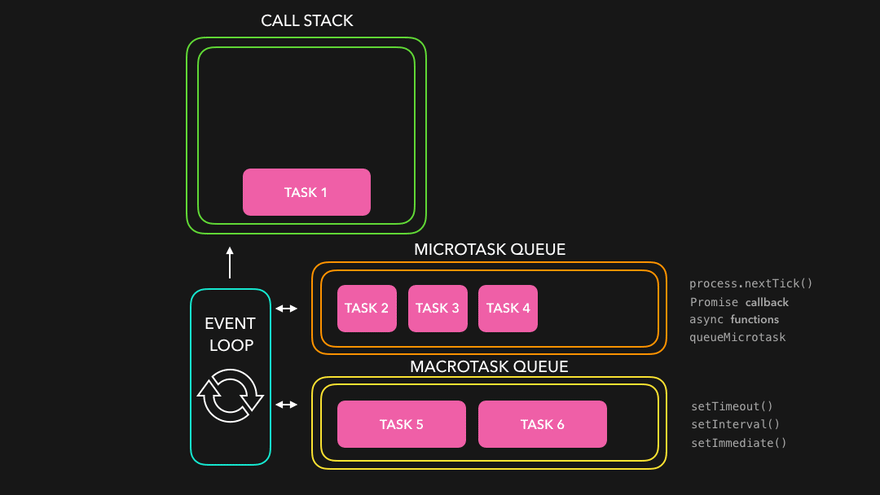

# Lesson 1 - Фундаментальний Node.js

## Налаштування оточення для Node js


[quick-start.md](quick-start.md)



## Прийом та обробка HTTP-запитів.

### **HTTP**

HTTP означає Hypertext Transfer Protocol (\* протокол прикладного рівня для "переговорів" про доставлення Web-сервером документа Web-браузеру. Зазвичай використовує порт 80, а у якості протоколу транспортного рівня - TCP

TCP (\* Transmission Control Protocol; протокол керування передаванням; широко використовуваний в Інтернеті мережний протокол транспортного рівня з набору TCP/IP.

HTTP дозволяє спілкуватися системам з різною архітектурою та конфігурацією мережі (\*певний склад обладнання ЛОМ (локальна обчислювальна мережа), схему його з'єднання та ПЗ мережі).\


<figure><figcaption></figcaption></figure>

### URL-адреси

В основі комунікації по Всесвітній павутині лежать повідомлення запитів, які пересилаються за допомогою URL-адрес (**Uniform Resource Locator** – уніфікований покажчик \[місцезнаходження інформаційного] ресурсу).

<figure><figcaption></figcaption></figure>

HTTPS (інші назви: HTTP over TLS, HTTP over SSL, і HTTP Secure) — схема URI, що синтаксично ідентична http: схемі, яка зазвичай використовується для доступу до ресурсів Інтернет.&#x20;

Використання https: URL вказує, що протокол HTTP має використовуватися, але з іншим портом за замовчуванням (443) і додатковим шаром шифрування/автентифікації між HTTP і TCP.

### Методи

URL-адреси ідентифікують певний сервер, із яким ми хочемо налагодити обмін повідомленнями, проте дія, яку необхідно виконати на сервері, вказується за допомогою методів HTTP

* **GET**: для запиту ресурсу. В URL-адресі міститься вся необхідна інформація для визначення місцезнаходження та повернення ресурсу сервером.&#x20;
* **POST**: для створення нового ресурсу. Запити POST звичайно містять дані для створення нового ресурсу.&#x20;
* **PUT**: для оновлення існуючого ресурсу. У вмісті можуть знаходитися оновлені дані для ресурсу.
* &#x20;**DELETE**: для видалення існуючого ресурсу.&#x20;
* **HEAD**: подібний до GET, проте не передається тіло повідомлення. Він використовується для отримання заголовків певного ресурсу від сервера, звичайно для того, щоб перевірити за допомогою тимчасової позначки, чи не змінився ресурс.&#x20;
* **TRACE**: використовується для отримання від сервера інформації про "стрибки" (\*найближчий маршрутизатор, маршрутизатор, що знаходиться на відстані одного "стрибка"), через які пройшов запит.
  1.

<figure><figcaption></figcaption></figure>

* **OPTIONS**: для отримання підтримуваних сервером можливостей. На стороні клієнта його можна використовувати для зміни запиту в залежності від можливостей, підтримуваних сервером.

### **Коди стану (коди помилок).**

**1xx: **_**Інформація про процес передачі**_

* **100** Continue (Продовжувати) (код та відповідна пояснююча фраза)

**2xx: **_**Інформація про вдалий прийом та оброблення запиту клієнта**_

* **202** Accepted (\* Прийнято): запит було прийнято на оброблення але у відповіді може не бути запитуваних даних. Цей варіант корисний для асинхронної обробки на стороні сервера.
* **204** No Content (Немає вмісту): тіло повідомлення не передається.
* **205** Reset Content (Скинути вміст): клієнт повинен скинути) уведені користувачем дан.
* **206** Partial Content (Частковий вміст) вказує, що у відповіді міститься тільки частина даних.

**3xx: **_**Переадресація**_

* **301** Moved Permanently (Постійно переміщений): запитуваний об'єкт було остаточно перенесено на новий URL.
* **303** See Other (Дивитися інший): запитуваний об'єкт було тимчасово перенесено на нову URL-адресу. Тимчасовий URL вказується у заголовку Location відповіді.
* **304** Not Modified (Не модифікований): сервер виявив, що ресурс не було змінено і клієнту варто використовувати копію з кеш-пам'яті. Це реалізується за допомогою того, що клієнт відправляє певне хеш-значення значення у заголовку ETag (Entity Tag). Сервер порівнює це значення зі своїм власним токеном для запитуваного ресурсу на наявність змін.

**4xx: **_**Інформація про помилки з боку клієнта**_

* **400** Bad Request (Зіпсований запит): у запиті знайдено помилку.
* **401** Unauthorized (Несанкціонований доступ): для здійснення запиту необхідна автентифікація
* **403** Forbidden (Заборонено): сервер відмовив клієнту у доступі до вказаного ресурсу.
* **405** Method Not Allowed (Метод не допустимий): у рядку запиту використовувався неприпустимий метод HTTP або ж сервер не підтримує цей метод.
* **409** Conflict (Конфлікт): сервер не зміг виконати запит, оскільки клієнт спробував змінити ресурс, відмітка часу якого не співпадає з такою клієнта. У більшості випадків конфліктна ситуація виникає при сумісному редагуванні ресурсу за допомогою запитів за методом PUT.

**5xx: **_**Інформація про помилки з боку сервера**_

* **501 Not Implemented** (\* Не реалізовано): сервер на цей момент не підтримує можливостей, необхідних для оброблення запиту.
* **503 Service Unavailable** (\* Сервіс недоступний): сервер не має можливості оброблювати запити з технічних причин або перевантажений.

більше інформації [тут](https://www.w3.org/Protocols/rfc2616/rfc2616.html)

## Организация коду Node.js

У сучасному JavaScript залишилося два основні стандарти модульних систем. Це CommonJS, яка є основною для платформи Node.js, та ESM (ECMAScript модулі), яка була прийнята як стандарт для мови та внесена до специфікації [**ES2015**](https://262.ecma-international.org/6.0/#sec-modules)****

### Що таке модулі?

Node js програма має модульну архітектуру побудови, причому кожен файл JavaScript розглядається як окремий модуль, який може залежати від інших модулів. Node js модулі можуть бути встановлювані (з використанням npm) та власні, які створюються у процесі розробки. Будь-який проект складніше Hello World складається з деякої кількості файлів, по яких розносять код.

### &#x20;**М**одули на commonjs та ES modules синтаксисе

Модулі CommonJS — це оригінальний спосіб упаковки коду JavaScript для Node.js. Node.js також підтримує стандарт [**модулів**](https://nodejs.org/api/esm.html) **** [**ECMAScript**](https://nodejs.org/api/esm.html) **** який використовується в браузерах та інших середовищах виконання JavaScript.

У Node.js кожен файл розглядається як окремий модуль. Наприклад, розглянемо файл з назвою foo.js:


```javascript
const circle = require('./circle.js');
console.log(`The area of a circle of radius 4 is ${circle.area(4)}`);
```


У першому рядку foo.js завантажує модуль circle.js, який знаходиться в тому ж каталозі, що й foo.js.&#x20;

Ось вміст circle.js


```javascript
const { PI } = Math;
exports.area = (r) => PI * r ** 2;
exports.circumference = (r) => 2 * PI * r;
```


Модуль circle.js експортував функції area()та circumference(). Функції та об’єкти додаються до кореня модуля шляхом визначення додаткових властивостей спеціального exports об’єкта. Змінні, локальні для модуля, будуть приватними, оскільки модуль загорнутий у функцію Node.js (дивіться оболонку модуля ). У цьому прикладі змінна PI є приватною для circle.js. Властивості module.exports можна призначити нове значення (наприклад, функцію чи об’єкт). Нижче bar.js використовується square модуль, який експортує клас Square:


```javascript
const Square = require('./square.js');
const mySquare = new Square(2);
console.log(`The area of mySquare is ${mySquare.area()}`);
```


Модуль square визначено в square.js:


```javascript
// Assigning to exports will not modify module, must use module.exports
module.exports = class Square {
  constructor(width) {
    this.width = width;
  }

  area() {
    return this.width ** 2;
  }
};
```


За замовчуванням Node.js розглядатиме наступне як модулі CommonJS:

* Файли з .cjs розширенням;
* Файли з .js розширенням, коли найближчий батьківський package.json файл містить поле верхнього рівня "type"зі значенням "commonjs".
* Файли з .js розширенням, коли найближчий батьківський package.json файл не містить поля верхнього рівня "type". Автори пакетів повинні включити це "type"поле, навіть у пакетах, де всі джерела є CommonJS. Якщо чітко typeрозповісти про пакет, інструментам збірки та завантажувачам буде легше визначити, як слід інтерпретувати файли в пакеті.
* Файли з розширенням, відмінним від .mjs, .cjs, .json, .node або .js (якщо найближчий батьківський package.json файл містить поле верхнього рівня "type"зі значенням "module", ці файли будуть розпізнані як модулі
* CommonJS лише в тому випадку, якщо їх буде створено require, а не під час використання команди -точка входу рядка програми).


Виклик require() завжди використовує завантажувач модуля CommonJS. Для виклику import() завжди використовуйте завантажувач модуля ECMAScript.


[**Область застосування модуля**](https://nodejs.org/api/modules.html#the-module-scope)

* [**\_\_dirname**](https://nodejs.org/api/modules.html#\_\_dirname)
* [**\_\_filename**](https://nodejs.org/api/modules.html#\_\_filename)
* [**exports**](https://nodejs.org/api/modules.html#exports)
* [**module**](https://nodejs.org/api/modules.html#module)
* [**require(id)**](https://nodejs.org/api/modules.html#requireid)

[**Об'єкт module\_**](https://nodejs.org/api/modules.html#the-module-object)

* [**module.children**](https://nodejs.org/api/modules.html#modulechildren)
* [**module.exports**](https://nodejs.org/api/modules.html#moduleexports)
* [**module.filename**](https://nodejs.org/api/modules.html#modulefilename)
* [**module.id**](https://nodejs.org/api/modules.html#moduleid)
* [**module.isPreloading**](https://nodejs.org/api/modules.html#moduleispreloading)
* [**module.loaded**](https://nodejs.org/api/modules.html#moduleloaded)
* [**module.parent**](https://nodejs.org/api/modules.html#moduleparent) **(depricated)**
* [**module.path**](https://nodejs.org/api/modules.html#modulepath)
* [**module.paths**](https://nodejs.org/api/modules.html#modulepaths)
* [**module.require(id)**](https://nodejs.org/api/modules.html#modulerequireid)

Отже:&#x20;

" **id** " зазвичай містить повний шлях до файлу. Якщо операційна система підтримує символічні посилання і файлова система їх підтримує звичайно, всі символічні посилання будуть тут відображені. Якщо ви є користувачем Windows і не знаєте, що таке символічні посилання, то нічого страшного для розуміння це не критично. "**id**" використовується всередині Node.JS. Як правило, ми самі його використовувати не будемо.

1. " **exports** " ми вже знаємо. Це експорти того, що видається назовні.
2. « **parent** » це посилання на батьківський модуль, тобто на той модуль, який required даний.
3. " **filename** " ім'я файлу, повне, з урахуванням шляху.
4. « **loaded** » Чи завантажився модуль. На момент, коли ми виводимо в консоль модуль, цей модуль ще до кінця не оброблений, то файл не виконаний до кінця, тому «loaded: false».
5. « **children** » Це відповідно ті модулі, які цей модуль підключив через « **require()** ». В даному випадку тут тільки один модуль, наш ru.json, який, зверніть увагу, loaded: true.
6. « **path :**» це теж внутрішня змінна як і «id» і ми її не використовуватимемо, я скажу про неї кілька слів, пізніше, коли ми розбиратимемо порядок пошуку модулів з урахуванням шляхів.

Приступимо до вивчення модулів ES. Для роботи з ними потрібно провести деякі підготовчі дії.

По-перше, ES модулі будуть працювати тільки якщо у файлі package.json вказати налаштування "type" зі значенням "module":


```json
{
    "type" : "module"
}
```


У нашому випадку в цьому файлі буде ще й налаштування "scripts" для зручного запуску Webpack:


```javascript
{
    "type" : "module",
    "scripts" : {
        "build" : "webpack"
    }
}
```


По-друге, у конфігураційному файлі Webpack замість module.exports слід написати export default, ось так:

<pre class="language-javascript" data-line-numbers><code class="lang-javascript">export default {
<strong>    entry: './index.js',
</strong>    output: {
        filename: './bundle.js',
    }
};</code></pre>

Після цього можна викликати наш збирач:


```bash
npm run build
```


## Налагодження процесу Node.js: скрипти, витоку пам'яті

* Відладчик node debug
* Налагодження під браузером Chrome
* Налагодження під IDE

Перший спосіб це запуск node debug script. При цьому нода відразу призупиняє виконання скрипту і переходить у спеціальний режим консольного налагодження. В якому можна одержати список команд через «help», керувати виконанням скрипта, переходити в режим консолі через «repl».


```bash
$ node debug script.js
< debugger listening on port 5858
connecting... ok
debug>
```


Це працює, але дуже просто. Хочеться якийсь зручніший інтерфейс, тому в тих випадках коли це можливо використовується налагодження під браузером Chrome, через node-inspector або під IDE

Для того, щоб така налагодження стала можливою, потрібно запустити ноду зі спеціальним прапором «debug» або «debug-brk», останній при цьому, переведе скрипт у стан зупинки відразу.

Для налагодження під браузером Chrome як відладчик можна використовувати node-inspector, який з одного боку підключається до порту ноди і вміє говорити з нею, з іншого боку він показує сторінку в Chome і приймає через неї команди, замість Chrome можуть бути інші браузери, достатньо сучасні.

Ну а відносно IDE це дуже залежить від самої IDE, але як на мене це найзручніший спосіб

<figure><figcaption></figcaption></figure>

просто натискаємо на іконку жука и налаштовуємо команду і версію ноди


### **Память в Node JS**

**Стек** (англ. stack) – це структура даних, що використовується для **** зберігання статичних даних, тобто, тих, чий розмір відомий під час компіляції JavaScript. Сюди включаються примітивні значення (string, number, boolean, undefined і null) і посилання функції і об'єкти.

Рух знає, що розмір даних не зміниться, і тому виділяє фіксований обсяг пам'яті для кожного значення.

Процес виділення пам'яті перед виконанням називається статичним.

Так як двигун виділяє фіксований обсяг пам'яті для подібних значень, логічно припустити, що існує ліміт на розмір примітивних значень. Залежно від використовуваного браузера ці обмеження, а також максимально допустимий розмір всього стека можуть змінюватись.

**Купа**: динамічне виділення пам'яті Купа (англ. memory heap) використовується для зберігання таких даних, як об'єкти та функції.

На відміну від випадку зі стеком, двигун не знає, який обсяг пам'яті знадобиться для тих чи інших об'єктів, а тому виділяє пам'ять у міру потреби.

Таке виділення пам'яті називають динамічним. Для наочності зведемо основні різницю між стеком і купою в таблицю:

| Стек                                 | Купа                             |
| ------------------------------------ | -------------------------------- |
| Примітивні значення та посилання     | Об'єкти та функції               |
| Розмір відомий під час компіляції    | Розмір відомий під час виконання |
| Виділяється фіксований обсяг пам'яті | Обсяг нічим не обмежений         |

якщо спробувати це візуалізувати то напевно повинно виглядати так

<figure><figcaption></figcaption></figure>

JS зберігає об'єкти та функції в купі. А ось примітивні значення та посилання – у стеку.

<figure><figcaption></figcaption></figure>

JavaScript поряд з Java, C# і Python належить до мов з автоматичним складанням сміття.

### Складання сміття

Тепер саме час повернутися до життєвого циклу пам'яті, а саме її звільнення.

Двигун JavaScript відповідає не лише за виділення пам'яті, а й за звільнення. При цьому пам'ять системі повертає збирач сміття (garbage collector).

І як тільки двигун «бачить», що в змінній функції або вже немає необхідності, виконується звільнення пам'яті.

Але тут криється ключова проблема. Справа в тому, що вирішити, чи потрібна певна область пам'яті чи ні, не можна. Немає настільки точних алгоритмів, що у режимі реального часу звільняють пам'ять.

Щоправда, є просто добре працюючі алгоритми, які дозволяють робити це. Вони не ідеальні, але все ж таки набагато краще, ніж багато інших.

Нижче — розповідь про складання сміття, що ґрунтується на підрахунку посилань, а також про «алгоритм позначок».

Алгоритм позначок - це частина процессу прибирання сміття. Алгоритм, який називається методом mark and sweep (помічай та вимітай). Цей алгоритм не рахує посилання, а визначає, чи можна отримати доступ до різних об'єктів за допомогою кореневого об'єкта. У браузері це window, а в Node.js - Global.

<figure><figcaption></figcaption></figure>

## Витік пам'яті (memory leak)

Проблеми з пам'яттю в таких мовах можна розділити на три категорії:&#x20;

* Не є витік: код і дані, які впираються в обмеження пам'яті. Обмеження можуть бути або штучними - закладеними в мову або середовище виконання, або природними - що випливають із характеристик заліза, на якому виконується код.
* Soft-витік (м'які, локальні витоку): щось заважає збирачеві сміття звільнити пам'ять, наприклад, список містить в одному з елементів посилання на давно не потрібний об'єкт.
* Hard-витік (жорсткі, глобальні витоку): пам'ять не звільняється, поки браузер або вся операційна система не буде перезапущено.

Важливо відрізняти витоки від неоптимального коду з високим споживанням пам'яті: іноді слова «у мене сторінка тече» некоректно використовуються там, де відкрито жадібний до пам'яті додаток, але витоку при цьому відсутні.

Тепер, озброївшись необхідними знаннями про управління пам'яттю, ми готові до аналізу найбільш поширених видів витоків пам'яті – обійти які, до речі, не складає особливих труднощів, коли розумієш усі процеси зсередини.

### **Глобальні змінні**

Зберігання даних глобальних змінних – тип витоків, який, мабуть, зустрічається найчастіше.

У браузері, наприклад, використання var замість const або let (не кажучи вже про відсутність ключового слова в принципі) призведе до того, що двигун приєднає змінну об'єкт до об'єкта window. Це ж станеться і з функціями, визначеними словом function.


```javascript
user = getUser();
var secondUser = getUser();
function getUser() {
  return 'user';
}
```


Усі три змінних – user, secondUser та getUser – будуть приєднані до об'єкта Windows

Такий сценарій застосовується лише стосовно функцій та змінних, оголошених у глобальній області видимості; уникнути проблем вам допоможе виконання коду у строгому режимі (англ. strict mode).

Створення глобальних змінних який завжди випадково: існує безліч прикладів, що вони оголошуються цілком навмисно. Головне в цій ситуації – не забути звільнити пам'ять, як тільки зникне потреба в даних.

Для цього надайте глобальній змінній null:

```javascript
window.users = null;
```

### Таймери та коллбеки

Забуті таймери та коллбеки можуть призвести до того, що програма почне використовувати більший обсяг пам'яті. У цьому контексті слід бути особливо уважними з односторінковими програмами (SPA) та динамічним додаванням коллбеків та спостерігачів подій.

### **Забуті таймери**


```javascript
onst object = {};
const intervalId = setInterval(function() {
  // Складальник сміття не обробить нічого, що використовується тут,
  // поки інтервал не буде очищений
  doSomething(object);
}, 2000);
```


Функція вище, виконується кожні 2 секунди. Якщо у вашому проекті є схожий код, можливо, його виконання не повинно бути нескінченним.

Об'єкти, на які є посилання в інтервалі, не будуть знищені, доки не відбудеться очищення інтервалу. Тому пам'ятайте, що потрібно своєчасно прописувати:

```
clearInterval(intervalId);
```

Особливої ​​важливості ця дія набуває у SPA: навіть якщо ви залишаєте сторінку, на якій потрібен той чи інший інтервал, його виконання все одно продовжується у фоновому режимі.

### Забуті відклики подій

Допустимо, ви призначили спостерігача onClick на кнопку, яку пізніше видалили через непотрібність.

Звільнити пам'ять, виділену для такого спостерігача, старі браузери просто не змогли б. Зараз ця проблема вже в минулому, але, незважаючи на це, все ще рекомендується явно видаляти спостерігачів подій, яких більше немає потреби:


```javascript
const element = document.getElementById('button');
const onClick = () => alert('hi');
element.addEventListener('click', onClick);
element.removeEventListener('click', onClick);
element.parentNode.removeChild(element);
```


### Посилання поза DOM

Цей витік пам'яті схожий на попередні: він виникає, коли елементи DOM зберігаються в JavaScript.


```javascript
const elements = [];
const element = document.getElementById('button');
elements.push(element);
function removeAllElements() {
  elements.forEach((item) => {
  document.body.removeChild(document.getElementById(item.id))
  });
}
```


Коли ви видаляєте будь-який з елементів вище, подбайте і про його видалення з масиву - інакше збирач сміття не буде обробляти відповідні DOM-елементи.


```javascript
const elements = [];
const element = document.getElementById('button');
elements.push(element);
function removeAllElements() {
  elements.forEach((item, index) => {
  document.body.removeChild(document.getElementById(item.id));
   elements.splice(index, 1);
 });
}
```


Видалення елемента з масиву дозволяє синхронізувати останній із DOM.

Так як кожен елемент DOM, до всього іншого, містить посилання на батьківський вузол, своїми діями ви можете перешкоджати збирачу сміття звільнити пам'ять, зайняту вузлами елемента.


В Node.js состояние памяти можно узнать вызовом process.memoryUsage():


## **Життя і смерть Node.JS-процесу, подійний цикл. Макро задачі та мікро задачі, наявність даних у Node.js.**

**І**снує кілька способів наміченого завершення процесу роботи. Серед них — наступні:

* Ручний вихід із процесу- **process.exit(1)**
* Не перехоплена помилка - **throw new Error()**
* Необроблене відхилення промісу - **Promise.reject()**
* Проігнорована подія **error** - **EventEmitter#emit('error')**
* Необроблений сигнал- **$ kill \<PROCESS\_ID>**

Багато цих операцій виконуються випадково, наприклад - це стосується new Error().

### Цикл подій

Ідея циклу подій дуже проста. Є безкінечний цикл, в якому рух JavaScript очікує завдання, виконує їх і знову очікує появи нових.

Загальний алгоритм руху:

1. Поки є завдання - виконуємо їх, починаючи з найстарішої
2. Бездіяльність та появлення нової задачі, до того, що пукт

Може так статися, що завдання виконується, коли рух зайнятий чим-то іншим, тоді вона ставиться в чергу.

Черга, що формує такі завдання, називають чергою макро задач (macrotask queue, TERMIN v8).&#x20;

Macrotask — це коротка функція, яка виконується після того, як функція або програма, яка її створила, виходить, і лише якщо стек виконання JavaScript порожній.

* _Promise callback_
* _queueMicrotask_

Macrotask — це коротка функція, яка виконується після того, як стек виконання JavaScript і мікро завдання порожні.

* _setTimeout_
* _setInterval_
* _setImmediate_

Як це працює

<figure><figcaption></figcaption></figure>

Існує спеціальна функція queueMicrotask(func), яка поміщає func у чергу мікро задач.

Відразу після кожної макро задачі двигун виконує всі завдання з черги мікро задач перед тим, як виконати наступне макро завдання або відобразити зміни на сторінці, або зробити щось ще.

Щоб додати до черги нове макро завдання - використовуйте setTimeout(f) із нульовою затримкою. Цей спосіб можна використовувати для розбиття великих обчислювальних завдань на частини, щоб браузер міг реагувати на події користувача і показувати прогрес виконання цих частин. Також це використовується в обробник подій для відкладеного виконання дії після того, як подія повністю оброблена (спливання завершено).

Для додавання нової мікро задачі в чергу - використовуйте queueMicrotask(f). Також обробники промісів виконуються у рамках черги мікрозавдань. Події інтерфейсу користувача та мережні події в проміжках між мікро задачами не обробляються: мікро завдання виконуються безперервно одна за одною. Тому queueMicrotask можна використовувати для асинхронного виконання функції у тому ж стані оточення.


Web Workers Для тривалих важких обчислень, які не повинні блокувати цикл подій, ми можемо використовувати [**Web Workers**](https://html.spec.whatwg.org/multipage/workers.html)

&#x20;Це спосіб виконати код в іншому паралельному потоці.&#x20;

Web Workers можуть обмінюватися повідомленнями з основним процесом, але вони мають свої змінні та свій подійний цикл.&#x20;

Web Workers немає доступу до DOM, тому основне їх застосування – обчислення.&#x20;

Вони дозволяють задіяти кілька ядер процесора одночасно.


## HTTP-сервер, асинхронная модель Node.js.

Створення базового сервера HTTP

```javascript
const http = require("http");
```

Модуль http містить функцію створення сервера, яку ми детальніше розглянемо пізніше

На наступному кроці ми визначимо дві константи, хост і порт, до яких буде прив'язаний наш сервер:

```javascript
const host = 'localhost';
const port = 8000;
```

Коли ми прив'яжемо наш сервер до цього хоста та порту, ми зможемо підключатися до нашого сервера, відкриваючи адресу http://localhost:8000 у локальному браузері.

Додамо спеціальну функцію, яку Node.js ми називаємо прослуховувач запитів. Ця функція призначена для обробки вхідних запитів HTTP та повернення відповіді HTTP. Ця функція повинна мати два аргументи, об'єкт запиту та об'єкт відповіді. Об'єкт запиту записує всі дані запиту HTTP. Об'єкт відповіді використовується для повернення серверу відповіді HTTP.

Нам потрібно, щоб наш перший сервер повертав наступне повідомлення під час спроби доступу до нього: "My first server!".

Додамо цю функцію:


```javascript
const requestListener = function (req, res) {
    res.writeHead(200);
    res.end("My first server!");
};
```


Рядок res.writeHead(200); задає код стану HTTP для відповіді Рядок res.end("My first server!") ; записує відповідь HTTP на клієнта, який його запросив. Ця функція повертає будь-які дані, які сервер повинен повертати. У цьому випадку повертатимуться текстові дані. Тепер ми можемо створити сервер та використовувати прослуховувач запитів:


```javascript
const server = http.createServer(requestListener);
server.listen(port, host, () => {
    console.log(`Server is running on http://${host}:${port}`);
});
```



Примітка. Хоча requestListener() не використовує об'єкт req, він має бути першим аргументом функції.


Ми створили веб-сервер, написавши менше п'ятнадцяти рядків коду. Перевіримо його роботу, запустивши програму:

```bash
node hello.js

//output
//Server is running on http://localhost:8000
```

Ми налаштували сервер і отримали від нього першу відповідь.

Тепер розглянемо деякі варіациї




```javascript
import * as http from "http";

const host = 'localhost';
const port = 8000;

const requestListener = function (req, res) {
        res.writeHead(200);
        res.end("My first server!");
};

const server = http.createServer(requestListener);

server.listen(port, host, () => {
    console.log(`Server is running on http://${host}:${port}`);
});
```




<pre class="language-javascript" data-line-numbers><code class="lang-javascript">const requestListener = function (req, res) {
<strong>        res.setHeader("Content-Type", "application/json");
</strong>        res.writeHead(200);
        res.end(`{"message": "This is a JSON response"}`);
};</code></pre>




```javascript
 const requestListener = function (req, res) {
        res.setHeader("Content-Type", "text/csv");
        res.setHeader("Content-Disposition", "attachment;filename=oceanpals.csv");
        res.writeHead(200);
        res.end(`id,name,email\n1,Kyrylo,kyrylo@gmail.com`);
  };
```





```javascript
const requestListener = function (req, res) {
    res.setHeader("Content-Type", "text/html");
    res.writeHead(200);
    res.end(`<html><body><h1>This is HTML</h1></body></html>`);
};
```





```javascript
import * as http from "http";
import {readFile} from 'node:fs';

const host = 'localhost';
const port = 8000;

const requestListener = function (req, res) {
    readFile(process.cwd() + "/3src/resource/index.html", 'utf8', ((err, data) => {
        if (err) {
            res.setHeader("Content-Type", "application/json");
            res.writeHead(500);
            console.log(err)
            res.end(JSON.stringify(err));
            return;
        }
        sendFile(data, res)
    }));
};

function sendFile(contents, res) {
    res.setHeader("Content-Type", "text/html");
    res.writeHead(200);
    res.end(contents);
}

const server = http.createServer(requestListener);

server.listen(port, host, () => {
    console.log(`Server is running on http://${host}:${port}`);
});
```





Останный приклад можно вдосконалити. Замість того, щоб завантажувати сторінку HTML для кожного запиту, ми завантажимо її лише один раз на самому початку. Запит повертатиме дані, завантажені нами під час запуску.


```javascript
import * as http from "http";
import {readFile} from 'node:fs';

const host = 'localhost';
const port = 8000;

let indexFile;

const requestListener = function (req, res) {
    res.setHeader("Content-Type", "text/html");
    res.writeHead(200);
    res.end(indexFile);
};

const server = http.createServer(requestListener);


readFile(process.cwd() + "/src/resource/index.html", 'utf8', ((err, data) => {
    if (err) {
        console.error(`Could not read index.html file: ${err}`);
        process.exit(1);
        return;
    }
    indexFile = data;
    server.listen(port, host, () => {
        console.log(`Server is running on http://${host}:${port}`);
    });
}));
```


Код, який зчитує файл, схожий на написаний нами при першій спробі. Однак при успішному читанні файлу ми можемо зберегти його вміст у глобальній змінній **indexFile**. Ми запустимо сервер із методом **listen()**. Головне – завантажити файл до запуску сервера. Так функція **requestListener()** гарантовано повертає сторінку HTML, оскільки змінна indexFile не порожня.

Блок обробки помилок також змінився. Якщо файл не вдається завантажити, ми записуємо помилку та виводимо її на консоль. Потім закриваємо програму Node.js за допомогою функції exit() без запуску сервера. Так ми бачимо, чому не вдалося прочитати файл і можемо вирішити проблему і знову запустити сервер.

Ми створили різні веб-сервери, які повертають користувачу різні типи даних. Поки що ми не використовували дані запитів для визначення конкретного контенту, що повертається. Нам потрібно використовувати дані запитів при налаштуванні маршрутів або шляхів сервера Node.js, тому тепер ми подивимося, як це працює.

### Налаштування серверу з декількома кінцевими точками

Більшість відвідуваних нами сайтів і використовуваних нами API мають кілька кінцевих точок, що дозволяє отримувати доступ до різних ресурсів.

Гарним прикладом є система управління книгами, яка може використовуватись у бібліотеці

В якості вмістилища використаемо глобальні змінні


```javascript
const books = JSON.stringify([
    { title: "The Alchemist", author: "Paulo Coelho", year: 1988 },
    { title: "The Prophet", author: "Kahlil Gibran", year: 1923 }
]);

const authors = JSON.stringify([
    { name: "Paulo Coelho", countryOfBirth: "Brazil", yearOfBirth: 1947 },
    { name: "Kahlil Gibran", countryOfBirth: "Lebanon", yearOfBirth: 1883 }
]);
```


Напишемо код який певерне з серверу перелік книг


```javascript
import * as http from "http";
import {readFile} from 'node:fs';

const host = 'localhost';
const port = 8000;

let indexFile;

const books = JSON.stringify([
    {title: "The Alchemist", author: "Paulo Coelho", year: 1988},
    {title: "The Prophet", author: "Kahlil Gibran", year: 1923}
]);

const authors = JSON.stringify([
    {name: "Paulo Coelho", countryOfBirth: "Brazil", yearOfBirth: 1947},
    {name: "Kahlil Gibran", countryOfBirth: "Lebanon", yearOfBirth: 1883}
]);

const requestListener = function (req, res) {
    try {
        switch (req.url) {
            case "/books":
                res.setHeader("Content-Type", "application/json");
                res.writeHead(200);
                res.end(books);
                break
            case "/" :
                res.setHeader("Content-Type", "text/html");
                res.writeHead(200);
                res.end(indexFile);
                break
            default:
                res.setHeader("Content-Type", "application/json");
                res.writeHead(404);
                res.end(`{code: 404, message: "Resource not found"}`);
        }
    } catch (e) {
        res.setHeader("Content-Type", "application/json");
        res.writeHead(500);
        res.end(JSON.stringify(e));
    }
}

const server = http.createServer(requestListener);


readFile(process.cwd() + "/src/resource/index.html", 'utf8', ((err, data) => {
    if (err) {
        console.error(`Could not read index.html file: ${err}`);
        process.exit(1);
        return;
    }
    indexFile = data;
    server.listen(port, host, () => {
        console.log(`Server is running on http://${host}:${port}`);
    });
}));

```


Як результат ми навчились стовювати сервер з декількома кінцевими точками і різними типами данних. Цей підхід можно використати для додатковії обробки методів.

### Асинхронність у JavaScript

Як було сказано, JavaScript — однопоточна синхронна мову. Рядки коду, написаного на JS, виконуються в порядку, в якому вони присутні в тексті, один за одним.

Але JavaScript було створено для використання у браузерах. Його основним завданням на самому початку була організація обробки подій, пов'язаних з діяльністю користувача. Наприклад - це такі події, як onClick, onMouseOver, onChange, onSubmit, і так далі. Як вирішувати такі завдання в рамках синхронної моделі програмування?

Відповідь криється в оточенні, в якому працює JavaScript. А саме ефективно вирішувати подібні завдання дозволяє браузер, даючи в розпорядження програміста відповідні API.

В оточенні Node.js є засоби для виконання не блокуючих операцій введення-виводу, таких як робота з файлами, організація обміну даними по мережі і так далі.

* jCollback - Обробник події приймає функцію, яка буде викликана у разі виникнення події. Виглядає це так:

```javascript
document.getElementById('button').addEventListener('click', () => {
  //пользователь щёлкнул по элементу
})
```

* Promise

```javascript
let done = true
const isItDoneYet = new Promise(
  (resolve, reject) => {
    if (done) {
      const workDone = 'Here is the thing I built'
      resolve(workDone)
    } else {
      const why = 'Still working on something else'
      reject(why)
    }
  }
)
```

* async/await

```javascript
const doSomethingAsync = () => {
    return new Promise((resolve) => {
        setTimeout(() => resolve('I did something'), 3000)
    })
}


const doSomething = async () => {
    console.log(await doSomethingAsync())
}
```

Хоч JavaScript — однопоточна синхронна мову, ми можемо використовувати інструменти які дозволяють зробити її багатозадачною.
