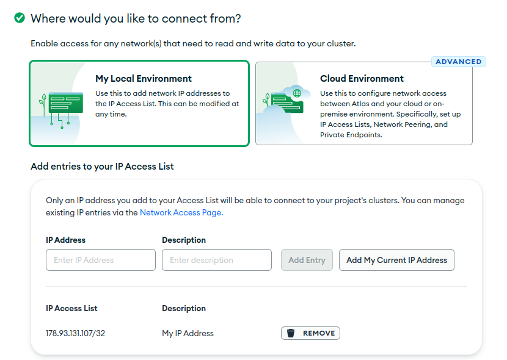
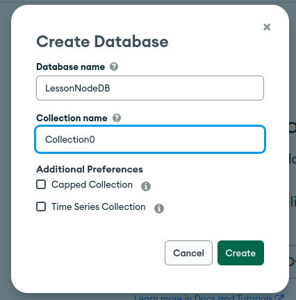
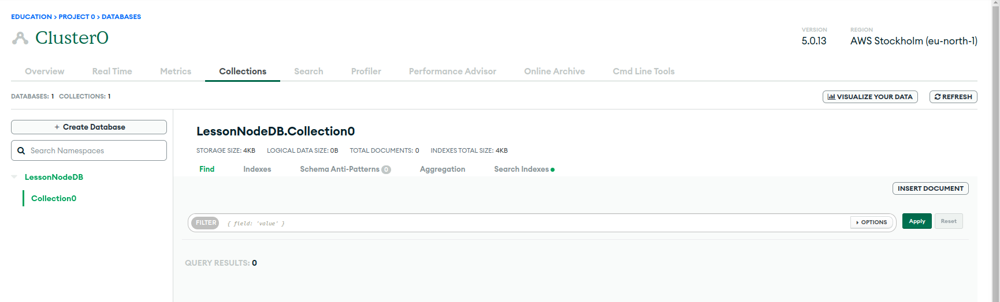
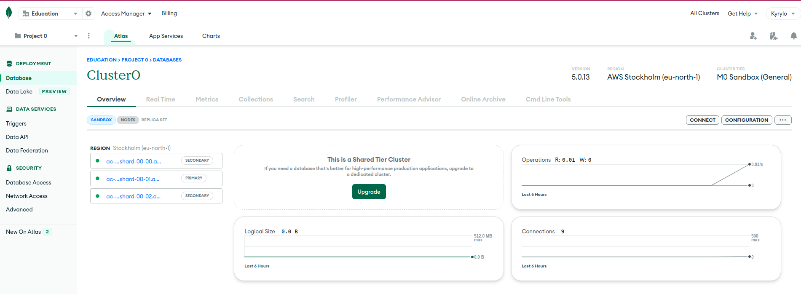
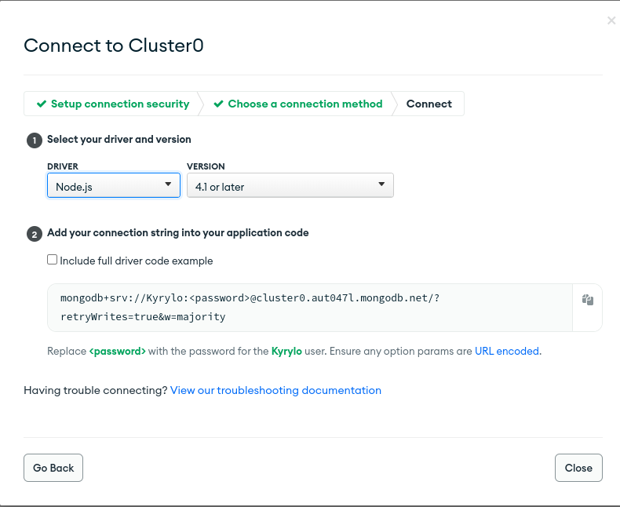

# Mongo

**MongoDB** — <mark style="color:blue;">документо-орієнтована система керування базами даних</mark> (СКБД) з <mark style="color:blue;">відкритим вихідним кодом</mark>, яка не потребує опису схеми таблиць. MongoDB займає нішу між швидкими і масштабованими системами, що оперують даними у форматі ключ/значення, і <mark style="color:blue;">реляційними СКБД</mark>, функціональними і зручними у формуванні запитів.

<mark style="color:blue;">Код</mark> MongoDB написаний на мові <mark style="color:blue;">C++</mark> і поширюється в рамках ліцензії <mark style="color:blue;">AGPLv</mark>3.

MongoDB підтримує зберігання документів в <mark style="color:blue;">JSON</mark>-подібному форматі, має досить гнучку мову для формування запитів, може створювати індекси для різних збережених атрибутів, ефективно забезпечує зберігання великих бінарних об'єктів, підтримує <mark style="color:blue;">журналювання</mark> операцій зі зміни і додавання даних в БД, може працювати відповідно до парадигми Map/Reduce, підтримує реплікацію і побудову відмовостійких конфігурацій. У MongoDB є вбудовані засоби із забезпечення шардінгу (розподіл набору даних по серверах на основі певного ключа), комбінуючи який з реплікацією даних можна побудувати горизонтально масштабований кластер зберігання, в якому відсутня єдина точка відмови (збій будь-якого вузла не позначається на роботі БД), підтримується автоматичне відновлення після збою і перенесення навантаження з вузла, який вийшов з ладу. Розширення кластера або перетворення одного сервера на кластер проводиться без зупинки роботи БД простим додаванням нових машин.

### Як MongoDB зберігає дані?

Перш ніж йти далі, давайте трохи розберемося, як дані зберігаються в MongoDB.

MongoDB зберігає дані в [документи BSON](https://docs.mongodb.com/manual/core/document/).&#x20;

BSON — це двійкове представлення документів JSON (JavaScript Object Notation). Коли ви читаєте документацію MongoDB, ви часто побачите термін [документ](https://docs.mongodb.com/manual/reference/glossary/#term-document), але ви можете розглядати документ як просто об’єкт JavaScript.

Документ можете розглядати як приблизно еквівалентний рядку в реляційних бд.


MongoDB зберігає групи документів у колекції. Можна вважати колекцію приблизно еквівалентною таблиці.


Кожен документ повинен мати поле з іменем `_id`. Значення `_id` має бути унікальним для кожного документа в колекції, є незмінним і може бути будь-якого типу, крім масиву. MongoDB автоматично створить індекс на `_id`. Ви можете зробити значення `_id` значущим (а не дещо випадковим).

[**ObjectId**](https://docs.mongodb.com/manual/reference/bson-types/#objectid) **-** унікальне значення для кожного документа, який ви хочете мати можливість швидкого пошуку.&#x20;

Давайте поглянемо на прикладі документа BSON:


```javascript
{
_id: new ObjectId("63527a3ff675945843e1064c")      
title: 'Titanic',
     year: 1997,
     genres: [ 'Drama', 'Romance' ],
     rated: 'PG-13',
     languages: [ 'English', 'French', 'German', 'Swedish', 'Italian', 'Russian' ],
     released: ISODate("1997-12-19T00:00:00.000Z"),
     awards: {
        wins: 127,
        nominations: 63,
        text: 'Won 11 Oscars. Another 116 wins & 63 nominations.'
     },
     cast: [ 'Leonardo DiCaprio', 'Kate Winslet', 'Billy Zane', 'Kathy Bates' ],
     directors: [ 'James Cameron' ]
  }
```


Додаткову інформацію про [MongoDB](https://www.mongodb.com/docs/) можна прочитати в офіційній документації.

### **Встановлення бази даних MongoDB**

Саме перше, що ми повинні зробити - встановити базу даних MongoDb, в якій будуть зберігатися дані нашої бібліотеки.\
Існує багато способів використання баз даних:

1. Локально за допомогою документацій [MongoDb](https://www.mongodb.com/docs/manual/installation/) (це не важче як встановити node.js)**;**
2. Використати [**docker**](https://www.docker.com/get-started/). За допомогою docker можна встановити не тільки MongoDb а й багато іншого (рекомендую для вивчення);
3. Скористатись Cloud server (AWS, Google…);
4. Atlas cloud-hosted sandbox database (хмарну базу даних пісочниці MongoDB Atlas).

В навчанні ми будемо використовувати використовувати хмарну базу даних пісочниці [**MongoDB Atlas**](https://www.mongodb.com/atlas/database).


Цей рівень бази даних не вважається придатним для робочих веб-сайтів, оскільки він не має надмірності, але він чудово підходить для розробки та створення прототипів.


Ми використовуємо його тут, оскільки він безкоштовний і простий у налаштуванні, а також тому, що MongoDB Atlas є популярною базою даних як постачальник послуг, якого ви можете розумно вибрати для своєї робочої бази даних (інші популярні варіанти на момент написання включають [**Compose**](https://www.compose.com/) , [**ScaleGrid**](https://scalegrid.io/pricing.html) і [**ObjectRocket**](https://www.objectrocket.com/) ).


Примітка. За бажанням ви можете налаштувати базу даних MongoDb локально, завантаживши та встановивши [**відповідні двійкові файли для вашої системи**](https://www.mongodb.com/download-center/community/releases). Решта інструкцій у цій статті будуть подібними, за винятком URL-адреси бази даних, яку ви вказуєте під час підключення. Зверніть увагу, однак, що [**підручник Express Tutorial Part 7: Deploying to Production**](https://developer.mozilla.org/en-US/docs/Learn/Server-side/Express\_Nodejs/deployment) вимагає певної форми віддаленої бази даних, оскільки безкоштовний рівень служби [**Heroku**](https://www.heroku.com/) не забезпечує постійного зберігання. Тому настійно рекомендується використовувати [**MongoDB Atlas**](https://www.mongodb.com/atlas/database) .


Спершу вам потрібно буде [create an account](https://www.mongodb.com/cloud/atlas/register) у MongoDB Atlas (це безкоштовно, і лише потрібно ввести основні контактні дані та прийняти їхні умови обслуговування).\
****

<figure><figcaption><p>Створення акаунту<br></p></figcaption></figure>

<figure><figcaption><p>Додаткові дані реєстрації</p></figcaption></figure>

після введення всіх даних потрібно підтвердити пошту

<figure><figcaption></figcaption></figure>

Після входу ви перейдете на [home](https://cloud.mongodb.com/v2) екран:

1\) Натисніть кнопку « **Build a Database** » у розділі « _Database Deployments_ »&#x20;

<figure><figcaption></figcaption></figure>

2\) Це відкриє екран _Deploy a cloud database._  Натисніть кнопку « **Create** » під параметром       « _Shared_».

<figure><figcaption></figcaption></figure>

3\) __ Відкриється екран _Create a Shared Cluster ._

<figure><figcaption></figcaption></figure>

* Виберіть будь-якого постачальника в розділі _Cloud Provider & Region_ . Різні регіони пропонують різних провайдерів.
* _Cluster Tier_ та _Additional Settings_ змінювати не потрібно. Ви можете змінити назву свого Cluster в розділі _Cluster Name_.  Ми називаємо це `Cluster0`для цього підручника.
* Натисніть кнопку **Create Cluster** (створення кластера займе кілька хвилин).

4\) Відкриється розділ S_ecurity Quickstart_.

<figure><figcaption><p>Створення користувача</p></figcaption></figure>

<figure><figcaption><p>Форма підключення</p></figcaption></figure>

Введіть ім'я користувача та пароль. Не забудьте скопіювати та безпечно зберегти облікові дані, оскільки вони нам знадобляться пізніше. Натисніть кнопку **Create User**.


Уникайте використання спеціальних символів у паролі користувача MongoDB, оскільки mongoose може не аналізувати рядок підключення належним чином.


* Введіть `0.0.0.0/0`у поле IP-адреса. Це повідомляє MongoDB, що ми хочемо дозволити доступ з будь-якого місця. Натисніть кнопку **Add Entry**.


Найкраще обмежити IP-адреси, які можуть підключатися до вашої бази даних та інших ресурсів. Тут ми дозволяємо підключення з будь-якого місця, тому що ми не знаємо, звідки надійде запит після розгортання.


* Натисніть кнопку **Finish і Close**.

5\) Це відкриє наступний екран. Натисніть кнопку **Go to Databases**.

<figure><figcaption></figcaption></figure>

6\) Ви повернетеся до екрана «_Database Deployments »._ Натисніть кнопку **Add My Own Data** .\


<figure><figcaption></figcaption></figure>

7\) Відкриється розділ _Collections_. Натисніть кнопку «**Add My Own Data**».

<figure><figcaption></figcaption></figure>

8\) Це відкриє екран _Create Database._

<figure><figcaption></figcaption></figure>

* Введіть назву для нової бази даних як `local_library`.
* Введіть назву колекції як `Collection0`.
* Натисніть кнопку **Create**, щоб створити базу даних.

9\) Ви повернетеся до екрана _Collections_ зі створеною базою даних_._

<figure><figcaption></figcaption></figure>

* Натисніть вкладку «_Overview_»,  щоб повернутися до огляду кластера.

10\) На екрані огляду _Cluster0_ натисніть кнопку **Connect**.

<figure><figcaption></figcaption></figure>

11\) Відкриється екран _Connect to Cluster._ Натисніть опцію «**Connect your application**».

<figure><figcaption></figcaption></figure>

12\) Тепер вам буде показано екран _Connect to Cluster0._

<figure><figcaption></figcaption></figure>

* Натисніть піктограму **Copy**, щоб скопіювати рядок підключення.
* Вставте це у свій локальний текстовий редактор.
* Оновіть пароль своїм паролем користувача.
* Замінити `myFirstDatabase`на `local_library`.
* Збережіть файл, що містить цей рядок, у безпечному місці.

Тепер ви створили базу даних і маєте URL-адресу (з іменем користувача та паролем), яку можна використовувати для доступу до неї. Це буде виглядати приблизно так: `mongodb+srv://Kyrylo:@cluster0.aut047l.mongodb.net/?retryWrites=true&w=majority`

## Перше підключення

Для тестування бд використайте наступний код


```javascript
const { MongoClient } = require("mongodb");
const username = encodeURIComponent("Name");
const password = encodeURIComponent("Password");
const cluster = "cluster0.aut047l.mongodb.net";

let uri =
    `mongodb+srv://${username}:${password}@${cluster}/?retryWrites=true&w=majority`;
const client = new MongoClient(uri);
async function testMongoConnection() {
    try {
        await client.connect();
        const database = client.db("LessonNodeDB");
        const ratings = database.collection("Collection0");
        const cursor = ratings.find();
        console.log(ratings)
        await cursor.forEach(doc => console.log(doc));

    } finally {
        await client.close();
    }
}
module.exports = testMongoConnection;

```



Не кодуйте спеціальні символи у своєму паролі, якщо ви використовуєте свій пароль за межами URI рядка підключення (наприклад, вставляючи його в[`mongosh`](https://www.mongodb.com/docs/mongodb-shell/#mongodb-binary-bin.mongosh)).


В майбутньому ми будемо використовувати бібліотеку Mongoose

### Встановіть Mongoose <a href="#install_mongoose" id="install_mongoose"></a>

Відкрийте командний рядок і перейдіть до каталогу, де ви створили скелет веб-сайту локальної бібліотеки . Введіть таку команду, щоб установити `Mongoose` (і його залежності) і додати її до свого файлу **`package.json.`**


```bash
npm install mongoose
```


### [Підключіться до MongoDB](https://developer.mozilla.org/en-US/docs/Learn/Server-side/Express\_Nodejs/mongoose#connect\_to\_mongodb) <a href="#connect_to_mongodb" id="connect_to_mongodb"></a>

Відкрийте **/app.js** (у кореневій папці вашого проекту) і скопіюйте наведений нижче текст, де ви оголошуєте _об’єкт програми Express_ (після рядка `const app = express();`). Замініть рядок URL-адреси бази даних (' _insert\_your\_database\_url\_here_ ') на URL-адресу розташування, яка представляє вашу власну базу даних (тобто використовуючи інформацію з _mongoDB Atlas_ ).


```javascript
// Import the mongoose module
const mongoose = require("mongoose");

// Set up default mongoose connection
const mongoDB = "mongodb://127.0.0.1/my_database";
mongoose.connect(mongoDB, { useNewUrlParser: true, useUnifiedTopology: true });

// Get the default connection
const db = mongoose.connection;

// Bind connection to error event (to get notification of connection errors)
db.on("error", console.error.bind(console, "MongoDB connection error:"));
```


Цей код створює типове з’єднання з базою даних і прив’язується до події помилки (таким чином помилки будуть виведені на консоль).

Ви можете отримати `Connection`об’єкт за замовчуванням за допомогою `mongoose.connection`. `Connection`Після підключення в екземплярі запускається подія open .


Якщо вам потрібно створити додаткові підключення, ви можете використовувати `mongoose.createConnection()`. Це приймає ту саму форму URI бази даних (з хостом, базою даних, портом, параметрами тощо), як `connect()`і повертає `Connection`об’єкт).


## Визначення та створення моделей <a href="#defining_and_creating_models" id="defining_and_creating_models"></a>

Наведений нижче фрагмент коду показує, як можна визначити просту схему. Спочатку ви `require()`мангуст, а потім використовуєте конструктор Schema, щоб створити новий екземпляр схеми, визначаючи різні поля всередині нього в параметрі об’єкта конструктора.

\



```javascript
// Require Mongoose
const mongoose = require("mongoose");

// Define a schema
const Schema = mongoose.Schema;

const SomeModelSchema = new Schema({
  a_string: String,
  a_date: Date,
});

```


У наведеному вище випадку ми маємо лише два поля, рядок і дату. У наступних розділах ми покажемо деякі інші типи полів, перевірку та інші методи.

### **Створення моделі**

Моделі створюються зі схем за допомогою `mongoose.model()`методу:


```javascript
// Define schema
const Schema = mongoose.Schema;

const SomeModelSchema = new Schema({
  a_string: String,
  a_date: Date,
});

// Compile model from schema
const SomeModel = mongoose.model("SomeModel", SomeModelSchema);
```


Перший аргумент — це однина назви колекції, яка буде створена в моделі (Mongoose створить колекцію бази даних для наведеної вище моделі _SomeModel_ вище), а другий аргумент — це схема, яку ви хочете використовувати для створення моделі.


Визначивши класи моделі, ви можете використовувати їх для створення, оновлення або видалення записів, а також виконувати запити для отримання всіх записів або окремих підмножин записів.


### **Типи схем (поля)**

Схема може мати довільну кількість полів — кожне з них представляє поле в документах, що зберігаються в _MongoDB_ . Нижче наведено приклад схеми, що показує багато загальних типів полів і те, як вони оголошуються.


```javascript
const schema = new Schema({
  name: String,
  binary: Buffer,
  living: Boolean,
  updated: { type: Date, default: Date.now() },
  age: { type: Number, min: 18, max: 65, required: true },
  mixed: Schema.Types.Mixed,
  _someId: Schema.Types.ObjectId,
  array: [],
  ofString: [String], // You can also have an array of each of the other types too.
  nested: { stuff: { type: String, lowercase: true, trim: true } },
});
```


Більшість [SchemaTypes](https://mongoosejs.com/docs/schematypes.html) (дескриптори після "type:" або після імен полів) не потребують пояснень. Винятками є:

* `ObjectId`: представляє конкретні екземпляри моделі в базі даних. Наприклад, книга може використовувати це для представлення об’єкта автора. Це фактично міститиме унікальний ідентифікатор ( `_id`) для вказаного об’єкта. Ми можемо використовувати цей `populate()`метод, щоб за потреби отримати пов’язану інформацію.
* [`Mixed`](https://mongoosejs.com/docs/schematypes.html#mixed): довільний тип схеми.
* `[]`: масив елементів. Над цими моделями можна виконувати операції з масивами JavaScript (push, pop, unshift тощо). У наведених вище прикладах показано масив об’єктів без указаного типу та масив `String`об’єктів, але ви можете мати масив об’єктів будь-якого типу.

Код також показує обидва способи оголошення поля:

* _Ім’я_ та _тип_ поля як пара ключ-значення (тобто як це робиться з полями `name`, `binary`та `living`).
* _Ім’я_ поля з об’єктом, що визначає `type`, та будь-які інші _параметри_ поля. Варіанти включають такі речі, як:
  * значення за замовчуванням.
  * вбудовані валідатори (наприклад, максимальні/мінімальні значення) і спеціальні функції перевірки.
  * Чи обов’язкове поле
  * Чи `String`мають поля автоматично встановлюватися на нижній, верхній регістр або обрізані (наприклад, `{ type: String, lowercase: true, trim: true }`)

Щоб отримати додаткові відомості про параметри, перегляньте [SchemaTypes](https://mongoosejs.com/docs/schematypes.html) (документи Mongoose).

### **Перевірка**

Mongoose надає вбудовані та спеціальні валідатори, а також синхронні та асинхронні валідатори. Це дозволяє вказати як прийнятний діапазон значень, так і повідомлення про помилку для помилки перевірки в усіх випадках.

Вбудовані валідатори включають:

* Усі [SchemaType](https://mongoosejs.com/docs/schematypes.html) мають вбудований [необхідний](https://mongoosejs.com/docs/api.html#schematype\_SchemaType-required) валідатор. Це використовується для визначення того, чи потрібно заповнювати поле для збереження документа.
* [Числа](https://mongoosejs.com/docs/api.html#schema-number-js) мають валідатори [min](https://mongoosejs.com/docs/api.html#schema\_number\_SchemaNumber-min) і [max .](https://mongoosejs.com/docs/api.html#schema\_number\_SchemaNumber-max)
* [Рядки](https://mongoosejs.com/docs/api.html#schema-string-js) мають:
  * [enum](https://mongoosejs.com/docs/api.html#schema\_string\_SchemaString-enum) : визначає набір дозволених значень для поля.
  * [match](https://mongoosejs.com/docs/api.html#schema\_string\_SchemaString-match) : визначає регулярний вираз, якому має відповідати рядок.
  * [maxLength](https://mongoosejs.com/docs/api.html#schema\_string\_SchemaString-maxlength) і [minLength](https://mongoosejs.com/docs/api.html#schema\_string\_SchemaString-minlength) для рядка.

Наведений нижче приклад (дещо змінений на основі документів Mongoose) показує, як можна вказати деякі типи валідаторів і повідомлення про помилки:


```javascript
const breakfastSchema = new Schema({
  eggs: {
    type: Number,
    min: [6, "Too few eggs"],
    max: 12,
    required: [true, "Why no eggs?"],
  },
  drink: {
    type: String,
    enum: ["Coffee", "Tea", "Water"],
  },
});
```


Щоб отримати повну інформацію про перевірку полів, перегляньте [перевірку](https://mongoosejs.com/docs/validation.html) (документи Mongoose).

### **Віртуальні властивості**

Віртуальні властивості — це властивості документа, які ви можете отримати та встановити, але які не зберігаються в MongoDB. Геттери корисні для форматування або об’єднання полів, тоді як сетери корисні для декомпозиції одного значення на кілька значень для зберігання. У прикладі в документації створюється (і деконструюється) віртуальна властивість повного імені з полів імені та прізвища, що простіше та чистіше, ніж конструювати повне ім’я кожного разу, коли воно використовується в шаблоні.


**В**іртуальна властивість у бібліотеці, щоб визначити унікальну URL-адресу для кожного запису моделі за допомогою шляху та значення запису `_id`.


Для отримання додаткової інформації див. [Віртуальні](https://mongoosejs.com/docs/guide.html#virtuals) (документація Mongoose).

### **Методи та помічники запитів**

Схема також може мати [методи екземплярів](https://mongoosejs.com/docs/guide.html#methods) , [статичні методи](https://mongoosejs.com/docs/guide.html#statics) та [помічники запитів](https://mongoosejs.com/docs/guide.html#query-helpers) . Метод екземпляра та статичний методи схожі, але з тією очевидною різницею, що метод екземпляра пов’язаний із певним записом і має доступ до поточного об’єкта. Помічники запитів дозволяють вам розширити [API конструктора ланцюжкових запитів](https://mongoosejs.com/docs/queries.html) mongoose (наприклад, дозволяючи додавати запит "byName" на додаток до методів `find()`, `findOne()`і ).`findById()`

### Використання моделей <a href="#using_models" id="using_models"></a>

Модель представляє набір документів у базі даних, за якими можна шукати, тоді як екземпляри моделі представляють окремі документи, які можна зберігати та отримувати.

Для отримання додаткової інформації див.: [Моделі](https://mongoosejs.com/docs/models.html) (документи Mongoose).

### **Створення та редагування документів**

Щоб створити запис, ви можете визначити екземпляр моделі, а потім викликати `save()`. У наведених нижче прикладах передбачається, що SomeModel — це модель (з одним полем «ім’я»), яку ми створили з нашої схеми.


```javascript
// Create an instance of model SomeModel
const awesome_instance = new SomeModel({ name: "awesome" });

// Save the new model instance, passing a callback
awesome_instance.save((err) => {
  if (err) return handleError(err);
  // saved!
});
```


Створення записів (разом з оновленнями, видаленнями та запитами) є асинхронними операціями — ви надаєте зворотний виклик, який викликається після завершення операції. API використовує угоду про помилку першим аргументом, тому першим аргументом для зворотного виклику завжди буде значення помилки (або нуль). Якщо API повертає якийсь результат, він буде наданий як другий аргумент.

**Т**акож можено використовувати `create()`для визначення екземпляра моделі під час його збереження. Зворотний виклик поверне помилку для першого аргументу та новостворений екземпляр моделі для другого аргументу.


```javascript
SomeModel.create({ name: "also_awesome" }, function (err, awesome_instance) {
  if (err) return handleError(err);
  // saved!
});
```


Кожна модель має пов’язане з’єднання (це буде з’єднання за умовчанням, коли ви використовуєте `mongoose.model()`). Ви створюєте нове підключення та викликаєте `.model()`його для створення документів в іншій базі даних.

Отримати доступ до полів у цьому новому записі за допомогою синтаксису крапки та змінити значення. При виклиці`save()`або `update()модель`зберігае чи змінюе значення в базі даних.


```javascript
// Access model field values using dot notation
console.log(awesome_instance.name); //should log 'also_awesome'

// Change record by modifying the fields, then calling save().
awesome_instance.name = "New cool name";
awesome_instance.save((err) => {
  if (err) return handleError(err); // saved!
});
```


### **Пошук записів**

Можна **** шукати записи за допомогою методів запиту, вказавши умови запиту як документ JSON. Наведений нижче фрагмент коду показує, як можна знайти в базі даних усіх спортсменів, які грають у теніс, повертаючи лише поля для _імені_ та _віку_ спортсмена . Тут ми лише вказуємо одне відповідне поле (вид спорту), але ви можете додати більше критеріїв, указати критерії регулярного виразу або взагалі видалити умови, щоб повернути всіх спортсменів.


```javascript
const Athlete = mongoose.model("Athlete", yourSchema);

// find all athletes who play tennis, selecting the 'name' and 'age' fields
Athlete.find({ sport: "Tennis" }, "name age", (err, athletes) => {
  if (err) return handleError(err);
  // 'athletes' contains the list of athletes that match the criteria.
});
```


Якщо ви вкажете зворотний виклик, як показано вище, запит буде виконано негайно. Зворотний виклик буде викликано після завершення пошуку.


Усі зворотні виклики в Mongoose використовують шаблон `callback(error, result)`. Якщо під час виконання запиту виникає помилка, `error`параметр міститиме документ про помилку та `result`буде нульовим. Якщо запит виконано успішно, `error`параметр матиме нульове значення, а поле `result`буде заповнено результатами запиту.



Важливо пам’ятати, що відсутність результатів **не є помилкою** для пошуку, але це може бути випадком помилки в контексті вашої програми. Якщо ваша програма очікує пошуку значення, ви можете перевірити результат у зворотному виклику        (`results==null`) або послідовному ланцюжку методу [orFail()](https://mongoosejs.com/docs/api.html#query\_Query-orFail) у запиті.


Якщо ви не вкажете зворотний виклик, тоді API поверне змінну типу [Query](https://mongoosejs.com/docs/api.html#query-js) . Ви можете використовувати цей об’єкт запиту, щоб створити свій запит, а потім виконати його (за допомогою зворотного виклику) пізніше за допомогою `exec()`методу.


```javascript
// find all athletes that play tennis
const query = Athlete.find({ sport: "Tennis" });

// selecting the 'name' and 'age' fields
query.select("name age");

// limit our results to 5 items
query.limit(5);

// sort by age
query.sort({ age: -1 });

// execute the query at a later time
query.exec((err, athletes) => {
  if (err) return handleError(err);
  // athletes contains an ordered list of 5 athletes who play Tennis
});
```


Вище ми визначили умови запиту в `find()`методі. Ми також можемо зробити це за допомогою `where()`функції, і ми можемо об’єднати всі частини нашого запиту разом за допомогою оператора крапки (.), а не додавати їх окремо. Наведений нижче фрагмент коду такий самий, як і наш запит вище, з додатковою умовою щодо віку.


```javascript
Athlete.find()
  .where("sport")
  .equals("Tennis")
  .where("age")
  .gt(17)
  .lt(50) // Additional where query
  .limit(5)
  .sort({ age: -1 })
  .select("name age")
  .exec(callback); // where callback is the name of our callback function.
```


Метод [find()](https://mongoosejs.com/docs/api.html#query\_Query-find) отримує всі відповідні записи, але часто потрібно отримати лише один збіг. Наступні методи запитують один запис:

* [`findById()`](https://mongoosejs.com/docs/api.html#model\_Model.findById): знаходить документ із зазначеним `id`(кожен документ має унікальний `id`).
* [`findOne()`](https://mongoosejs.com/docs/api.html#query\_Query-findOne): знаходить один документ, який відповідає вказаним критеріям.
* [`findByIdAndRemove()`](https://mongoosejs.com/docs/api.html#model\_Model.findByIdAndRemove), [`findByIdAndUpdate()`](https://mongoosejs.com/docs/api.html#model\_Model.findByIdAndUpdate), [`findOneAndRemove()`](https://mongoosejs.com/docs/api.html#query\_Query-findOneAndRemove), [`findOneAndUpdate()`](https://mongoosejs.com/docs/api.html#query\_Query-findOneAndUpdate): знаходить окремий документ за `id`критерієм або оновлює або видаляє його. Це корисні зручні функції для оновлення та видалення записів.


Існує також [`count()`](https://mongoosejs.com/docs/api.html#model\_Model.count)метод, за допомогою якого можна отримати кількість елементів, які відповідають умовам. Це корисно, якщо ви хочете виконати підрахунок без фактичного отримання записів.


За допомогою запитів можна зробити багато іншого. Для отримання додаткової інформації див.: [Queries](https://mongoosejs.com/docs/queries.html) (документи Mongoose).

### **Робота з супутніми документами — населення**

Ви можете створювати посилання з одного документа/примірника моделі на інший за допомогою `ObjectId`поля схеми або з одного документа на багато за допомогою масиву `ObjectIds`. Поле зберігає ідентифікатор пов’язаної моделі. Якщо вам потрібен фактичний вміст пов’язаного документа, ви можете використовувати [`populate()`](https://mongoosejs.com/docs/api.html#query\_Query-populate)метод у запиті, щоб замінити ідентифікатор фактичними даними.

Наприклад, наведена нижче схема визначає авторів і історії. Кожен автор може мати кілька історій, які ми представляємо як масив `ObjectId`. У кожної історії може бути один автор. Властивість `ref`повідомляє схемі, яку модель можна призначити цьому полю.


```javascript
const mongoose = require("mongoose");

const Schema = mongoose.Schema;

const authorSchema = Schema({
  name: String,
  stories: [{ type: Schema.Types.ObjectId, ref: "Story" }],
});

const storySchema = Schema({
  author: { type: Schema.Types.ObjectId, ref: "Author" },
  title: String,
});

const Story = mongoose.model("Story", storySchema);
const Author = mongoose.model("Author", authorSchema);
```


Ми можемо зберегти наші посилання на відповідний документ, призначивши `_id`значення. Нижче ми створюємо автора, потім історію та призначаємо ідентифікатор автора в поле автора нашої історії.


```javascript
const bob = new Author({ name: "Bob Smith" });

bob.save((err) => {
  if (err) return handleError(err);

  // Bob now exists, so lets create a story
  const story = new Story({
    title: "Bob goes sledding",
    author: bob._id, // assign the _id from our author Bob. This ID is created by default!
  });

  story.save((err) => {
    if (err) return handleError(err);
    // Bob now has his story
  });
});
```


Наш документ історії тепер має автора, на якого посилається ідентифікатор документа автора. Щоб отримати інформацію про автора в результатах історії, ми використовуємо `populate()`, як показано нижче.


```javascript
Story.findOne({ title: "Bob goes sledding" })
  .populate("author") // This populates the author id with actual author information!
  .exec((err, story) => {
    if (err) return handleError(err);
    console.log("The author is %s", story.author.name);
    // prints "The author is Bob Smith"
  });
```



Уважні читачі помітять, що ми додали автора до нашої історії, але ми нічого не зробили, щоб додати нашу історію до нашого `stories`масиву авторів. Як тоді ми можемо отримати всі історії певного автора? Одним із способів було б додати нашу історію до масиву історій, але це призведе до того, що ми матимемо два місця, де потрібно зберігати інформацію про авторів та історії.

Кращий спосіб — отримати `_id`автора , а потім використати його для пошуку в полі автора в усіх історіях _._`find()`


```javascript
Story.find({ author: bob._id }).exec((err, stories) => {
  if (err) return handleError(err);
  // returns all stories that have Bob's id as their author.
});
```



Це майже все, що вам потрібно знати про роботу з пов'язаними елементами для цього _tutorial._ Для отримання більш детальної інформації див. [Population](https://mongoosejs.com/docs/populate.html) (документи Mongoose).

### Одна схема/модель на файл

Хоча ви можете створювати схеми та моделі, використовуючи будь-яку файлову структуру, наполеглево рекомендую визначити кожну схему моделі в окремому модулі (файлі), а потім експортувати метод для створення моделі. Це показано нижче:


```javascript
// File: ./models/somemodel.js

// Require Mongoose
const mongoose = require("mongoose");

// Define a schema
const Schema = mongoose.Schema;

const SomeModelSchema = new Schema({
  a_string: String,
  a_date: Date,
});

// Export function to create "SomeModel" model class
module.exports = mongoose.model("SomeModel", SomeModelSchema);
```


Потім ви можете вимагати та використовувати модель негайно в інших файлах. Нижче наведено приклад, як ви можете використовувати його, щоб отримати всі екземпляри моделі.


```javascript
// Create a SomeModel model just by requiring the module
const SomeModel = require("../models/somemodel");

// Use the SomeModel object (model) to find all SomeModel records
SomeModel.find(callback_function);
```


\


\


