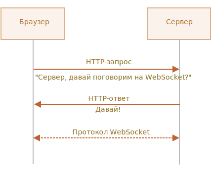

# Lesson 9 - Чаты, непрерывная подгрузка и обмен данными

## WebSockets <a href="#an-overview-of-web-sockets" id="an-overview-of-web-sockets"></a>

З’єднання WebSocket – це тонкий транспортний рівень, побудований поверх стеку [TCP/IP](https://en.wikipedia.org/wiki/Transmission\_Control\_Protocol) пристрою . Це максимально близький до необробленого рівня зв’язку TCP, хоча він додає кілька абстракцій, щоб усунути певне тертя та задовольнити той факт, що Інтернет має додаткові міркування щодо безпеки, які необхідно враховувати, щоб захистити обох споживачів і постачальників послуг.

<figure><figcaption></figcaption></figure>

## Long polling

Long polling - потребує опитування запитів/відповідей HTTP і робить його ефективнішим, оскільки повторні запити до сервера витрачають ресурси. Наприклад, встановлення нового з’єднання, аналіз HTTP-заголовків, запит на отримання нових даних, генерація та доставка відповіді та, нарешті, закриття та очищення з’єднання.

Щоб уникнути цих зусиль, під час тривалого опитування сервер вирішує утримувати з’єднання клієнта відкритим якомога довше та надає відповідь, коли нові дані стають доступними або якщо досягнуто порогового значення часу очікування.

\


<figure><figcaption></figcaption></figure>

## Server Sent Events (SSE) <a href="#an-overview-of-server-sent-events-sse" id="an-overview-of-server-sent-events-sse"></a>

Події, надіслані сервером (SSE) , засновані на подіях DOM, надісланих сервером, які вперше були реалізовані в Opera 9. Ідея проста: браузер може підписатися на потік подій, створених сервером, отримуючи оновлення кожного разу, коли з’являється нова відбувається подія. Це призвело до народження популярного інтерфейсу EventSource, який приймає потокове з’єднання HTTP і зберігає з’єднання відкритим під час отримання з нього доступних даних.

З’єднання залишається відкритим (доки воно не отримає вказівку закрити) шляхом виклику [EventSource.close()](https://developer.mozilla.org/en-US/docs/Web/API/EventSource/close). SSE — це стандарт, який описує, як сервери можуть ініціювати передачу даних клієнтам після встановлення початкового підключення клієнта. Він забезпечує реалізацію потокової передачі XHR з ефективним використанням пам’яті.&#x20;

На відміну від необробленого з’єднання XHR, яке буферизує повну отриману відповідь, доки з’єднання не буде розірвано, з’єднання SSE може відхиляти оброблені повідомлення, не накопичуючи їх усі в пам’яті.&#x20;

SSE розроблено для використання API JavaScript EventSource для підписки на потік даних у будь-якому популярному браузері. За допомогою цього інтерфейсу клієнт запитує певну URL-адресу для отримання потоку подій. SSE зазвичай використовується для надсилання оновлень повідомлень або безперервних потоків даних клієнту браузера. Підсумовуючи, подія, надіслана сервером, — це коли оновлення надсилаються (а не витягуються або запитуються) із сервера в браузер.

## **WebSockets: плюси і мінуси** <a href="#web-sockets-pros-and-cons" id="web-sockets-pros-and-cons"></a>

### Переваги WebSocket <a href="#web-socket-advantages" id="web-socket-advantages"></a>

* WebSockets зберігає унікальне з’єднання відкритим, усуваючи проблеми затримки, які виникають із тривалим опитуванням.
* Повнодуплексний асинхронний обмін повідомленнями підтримується, щоб і клієнт, і сервер могли передавати повідомлення один одному незалежно.
* WebSockets зазвичай не використовують `XMLHttpRequest`, і тому заголовки не надсилаються під час кожного запиту на сервер. Це, у свою чергу, зменшує розмір корисних даних.
* WebSockets проходять через більшість брандмауерів без будь-якої зміни конфігурації та мають модель безпеки на основі походження.

### Недоліки WebSocket <a href="#web-socket-disadvantages" id="web-socket-disadvantages"></a>

* WebSockets не відновлюються автоматично, коли з’єднання припинено – це те, що вам потрібно реалізувати самостійно, і це частина причини, чому існує багато бібліотек на стороні клієнта.
* Браузери старше 2011 року не можуть підтримувати з’єднання WebSocket, але це стає дедалі неактуальним.

## Long polling : плюси і мінуси <a href="#long-polling-pros-and-cons" id="long-polling-pros-and-cons"></a>

### Переваги тривалого опитування <a href="#long-polling-advantages" id="long-polling-advantages"></a>

* Long polling реалізовано на задній частині [`XMLHttpRequest`](https://developer.mozilla.org/en-US/docs/Web/API/XMLHttpRequest), який майже повсюдно підтримується пристроями, тому зазвичай немає потреби підтримувати додаткові резервні рівні.
* У випадках, коли винятки необхідно обробляти, або якщо сервер може запитувати нові дані, але не підтримує long polling (не кажучи вже про інші більш сучасні технологічні стандарти), базове опитування іноді все ще може мати обмежене використання та може бути реалізовано за допомогою `XMLHttpRequest`або через JSONP за допомогою простих тегів сценарію HTML.

### Недоліки тривалого опитування <a href="#long-polling-disadvantages" id="long-polling-disadvantages"></a>

* Тривале опитування потребує більше ресурсів на сервері, ніж з’єднання WebSocket.
* Довге опитування може супроводжуватися затримкою, оскільки вимагає кількох переходів між серверами та пристроями. Шлюзи часто мають різні уявлення про те, як довго звичайне з’єднання може залишатися відкритим, тому іноді закриваються, поки обробка ще триває.
* Надійне впорядкування повідомлень може бути проблемою з тривалим опитуванням, тому що кілька HTTP-запитів від одного клієнта можуть виконуватися одночасно. Наприклад, якщо клієнт має дві відкриті вкладки браузера, які споживають той самий ресурс сервера, а клієнтська програма зберігає дані в локальному сховищі, наприклад `localStorage`або `IndexedDb`, немає вбудованої гарантії, що повторювані дані не будуть записані далі ніж один раз.
* Залежно від реалізації сервера підтвердження отримання повідомлення одним екземпляром клієнта може призвести до того, що інший екземпляр клієнта взагалі ніколи не отримає очікуване повідомлення, оскільки сервер може помилково вважати, що клієнт уже отримав дані, які він очікує.

## Сервер-Sent-Events (SSE): переваги і недоліки <a href="#server-sent-events-sse-pros-and-cons" id="server-sent-events-sse-pros-and-cons"></a>

#### Переваги SSE <a href="#sse-advantages" id="sse-advantages"></a>

* Транспортується через простий HTTP замість спеціального протоколу
* Може бути заповнений javascript для "backport" SSE до браузерів, які ще не підтримують його.
* Вбудована підтримка повторного підключення та ідентифікатора події
* Корпоративні брандмауери перевіряють пакети
* Корисно для додатків, які дозволяють односторонню передачу даних, наприклад, поточні ціни на акції

#### SSE виклики <a href="#sse-challenges" id="sse-challenges"></a>

* SSE обмежено UTF-8 і не підтримує двійкові дані.
* SSE має обмеження щодо максимальної кількості відкритих підключень. Це може бути особливо болючим під час відкриття різних вкладок, оскільки обмеження встановлено для _кожного браузера_ та встановлено на дуже низьке число (6).
* SSE односпрямована

#### Після того я ознайомились з 3-ма альтернативами постійної передачі данних розглянемо більш детально одну с них а саме **Websockets**

## WebSocket

Протокол `WebSocket`(«веб-сокет»), описаний у специфікації [RFC 6455](http://tools.ietf.org/html/rfc6455) забезпечує можливість обміну даними між браузером і сервером через постійне з'єднання. Дані передаються в обох напрямках у вигляді «пакетів», без розриву з'єднання і додаткових HTTP-запитів.

WebSocket особливо хороший для сервісів, які потребують постійного обміну даними, наприклад онлайн ігри, торгові майданчики, що працюють у реальному часі, і т.д.

### Простий приклад

Щоб відкрити веб-сокет-з'єднання, нам потрібно створити об'єкт `new WebSocket`, вказавши в URL-адресі спеціальний протокол `ws`:

```javascript
let socket = new WebSocket("ws://javascript.info");
```

Також існує протокол `wss://`, який використовує шифрування. Це як HTTPS для веб-сокетів.

Завжди волійте`wss://`

Протокол `wss://`не тільки використовує шифрування, але й має підвищену надійність.

Це тому, що дані `ws://`не зашифровані, помітні для будь-якого посередника. Старі проксі-сервери не знають про WebSocket, вони можуть побачити "дивні" заголовки та закрити з'єднання.

З іншого боку, `wss://`це WebSocket поверх TLS (так само, як HTTPS – це HTTP поверх TLS), безпечний транспортний рівень шифрує дані від відправника та розшифровує на стороні одержувача. Пакети даних передаються у зашифрованому вигляді через проксі, які не можуть бачити, що всередині, та завжди пропускають їх.

Як тільки об'єкт `WebSocket`створено, ми маємо слухати його події. Їх всього 4:

* **`open`**- з'єднання встановлено,
* **`message`**– отримані дані,
* **`error`**– помилка,
* **`close`**- З'єднання закрито.

Якщо ми хочемо відправити щось, то виклик `socket.send(data)`зробить це.

Приклад:

```javascript
let socket = new WebSocket("wss://javascript.info/article/websocket/demo/hello");

socket.onopen = function(e) {
  alert("[open] зеднання встановлено");
  alert("Вдправляемо данні на сервер");
  socket.send("Моє ім'я Кирило");
};

socket.onmessage = function(event) {
  alert(`[message] Данні отримані з сервера: ${event.data}`);
};

socket.onclose = function(event) {
  if (event.wasClean) {
    alert(`[close] Зеднання закрито, код=${event.code} причина=${event.reason}`);
  } else {
      alert('[close] Зеднання прервано');
  }
};

socket.onerror = function(error) {
  alert(`[error]`);
};
```

Для демонстрації є невеликий приклад сервера [server.js](https://learn.javascript.ru/article/websocket/demo/server.js) , написаного на Node.js для запуску прикладу вище. Він відповідає "Привіт із сервера, Джон", після чекає 5 секунд і закриває з'єднання.

Так ви побачите події `open`→ `message`→ `close`.

Загалом, все, ми можемо спілкуватися за протоколом WebSocket. Просто, чи не так?

Тепер давайте поговоримо докладніше.

### Відкриття веб-сокету

Коли `new WebSocket(url)`створений, він одразу сам починає встановлювати з'єднання.

Браузер, за допомогою спеціальних заголовків, запитує сервер: Ти підтримуєш Websocket? і якщо сервер відповідає так, вони починають працювати за протоколом WebSocket, який вже не є HTTP.

<figure><figcaption></figcaption></figure>

Ось приклад заголовків для запиту, що робить `new WebSocket("wss://javascript.info/chat")`.

```
GET /chat
Host: javascript.info
Origin: https://javascript.info
Connection: Upgrade
Upgrade: websocket
Sec-WebSocket-Key: Iv8io/9s+lYFgZWcXczP8Q==
Sec-WebSocket-Version: 13
```

* `Origin`– джерело поточної сторінки (наприклад, `https://javascript.info`). Об'єкт WebSocket за своєю природою не зав'язаний поточне джерело. Немає жодних спеціальних заголовків чи інших обмежень. Старі сервери все одно не можуть працювати з WebSocket, тому проблем із сумісністю немає. Але заголовок `Origin`важливий, оскільки він дозволяє серверу вирішувати, чи використовувати WebSocket із цим сайтом.
* `Connection: Upgrade`- Сигналізує, що клієнт хотів би змінити протокол.
* `Upgrade: websocket`- Запитано протокол «websocket».
* `Sec-WebSocket-Key`- Випадковий ключ, створений браузером для забезпечення безпеки.
* `Sec-WebSocket-Version`- Версія протоколу WebSocket, поточна версія 13.


Запит WebSocket не можна емулювати!

Ми не можемо використовувати `XMLHttpRequest`або `fetch`створити такий HTTP-запит, тому що JavaScript не дозволяє встановлювати такі заголовки.


Якщо сервер згоден перейти на WebSocket, то він повинен відправити у відповідь код 101:

```
101 Switching Protocols
Upgrade: websocket
Connection: Upgrade
Sec-WebSocket-Accept: hsBlbuDTkk24srzEOTBUlZAlC2g=
```

Тут `Sec-WebSocket-Accept`– це `Sec-WebSocket-Key`, перекодований за допомогою спеціального алгоритму. Браузер використовує його, щоб переконатися, що відповідь відповідає запиту.

Після цього дані передаються за протоколом WebSocket, і невдовзі ми побачимо його структуру (фрейми). І це зовсім не HTTP.

### Розширення та підпротоколи

Можуть бути додаткові заголовки `Sec-WebSocket-Extensions`і описи `Sec-WebSocket-Protocol`розширення і підпротоколи.

Наприклад:

* `Sec-WebSocket-Extensions: deflate-frame`означає, що браузер підтримує стиснення даних. Розширення – це, пов'язані з передачею даних, що розширює сам протокол WebSocket. Заголовок `Sec-WebSocket-Extensions`надсилається браузером автоматично зі списком різноманітних розширень, які він підтримує.
*   `Sec-WebSocket-Protocol: soap, wamp`означає, що ми будемо передавати не тільки довільні дані, а й дані в протоколах [SOAP](https://en.wikipedia.org/wiki/SOAP) або WAMP (The WebSocket Application Messaging Protocol" – "протокол обміну повідомленнями WebSocket додатків"). Тобто цей заголовок описує не передачу, а формат даних, який ми збираємося використовувати Офіційні підпротоколи WebSocket реєструються в [каталозі IANA](http://www.iana.org/assignments/websocket/websocket.xml) .

    Цей необов'язковий заголовок ставимо ми самі, передаючи масив підпротоколів другим параметром `new WebSocket`.

    ```javascript
    let socket = new WebSocket("wss://javascript.info/chat", ["soap", "wamp"]);
    ```

Сервер повинен відповісти переліком протоколів та розширень, які він може використати.

Наприклад, запит:

```
GET /chat
Host: javascript.info
Upgrade: websocket
Connection: Upgrade
Origin: https://javascript.info
Sec-WebSocket-Key: Iv8io/9s+lYFgZWcXczP8Q==
Sec-WebSocket-Version: 13
Sec-WebSocket-Extensions: deflate-frame
Sec-WebSocket-Protocol: soap, wamp
```

Відповідь:

```
101 Switching Protocols
Upgrade: websocket
Connection: Upgrade
Sec-WebSocket-Accept: hsBlbuDTkk24srzEOTBUlZAlC2g=
Sec-WebSocket-Extensions: deflate-frame
Sec-WebSocket-Protocol: soap
```

Тут сервер відповідає, що підтримує розширення – deflate-frame і може використовувати лише протокол SOAP із усього списку запитаних підпротоколів.

### Передача даних

Потік даних у WebSocket складається з «фреймів», фрагментів даних, які можуть бути надіслані будь-якою стороною, та які можуть бути наступними видами:

* «текстові кадри» – містять текстові дані, які сторони надсилають одна одній.
* «Бінарні фрейми» – містять бінарні дані, які сторони надсилають одна одній.
* "пінг-понг фрейми" використовується для перевірки з'єднання; відправляється із сервера, браузер реагує на них автоматично.
* також є «фрейм закриття з'єднання» та деякі інші службові кадри.

У браузері ми працюємо безпосередньо з текстовими та бінарними кадрами.

**Метод WebSocket `.send()`може надсилати і текстові та бінарні дані.**

Виклик `socket.send(body)`приймає `body`у вигляді рядка або будь-якому бінарному форматі, включаючи `Blob`, `ArrayBuffer`та інші. Додаткових налаштувань не потрібно, просто надсилаємо у будь-якому форматі.


При отриманні даних текст завжди надходить у вигляді рядка. А для бінарних даних ми можемо вибрати один із двох форматів: `Blob`або `ArrayBuffer`**.**


Це задається властивістю `socket.binaryType`, за умовчанням воно одно `"blob"`, так що бінарні дані надходять у вигляді `Blob`об'єктів.

[Blob](https://learn.javascript.ru/blob) – це високорівневий бінарний об'єкт, він безпосередньо інтегрується з `<a>`, ``та іншими тегами, так що це зручне значення за умовчанням. Але для обробки даних, якщо потрібний доступ до окремих байтів, ми можемо змінити його на `"arraybuffer"`:

```javascript
socket.binaryType = "arraybuffer";
socket.onmessage = (event) => {
  // event.data является строкой (если текст) или arraybuffer (если двоичные данные)
};
```

### [Обмеження швидкості](https://learn.javascript.ru/websocket#ogranichenie-skorosti)

Уявимо, що наша програма генерує багато даних для відправки. Але у користувача повільне з'єднання, можливо, воно в інтернеті з мобільного телефону і не з міста.

Ми можемо викликати `socket.send(data)`знову і знову. Але дані будуть буферизовані (збережені) у пам'яті та відправлені лише з тією швидкістю, яку дозволяє мережа.

Властивість `socket.bufferedAmount`зберігає кількість байт буферизованих даних на поточний момент, що очікують відправки по мережі.

Ми можемо вивчити його, щоб побачити, чи дійсно сокет доступний для передачі.

```javascript
// каждые 100мс проверить сокет и отправить больше данных,
// только если все текущие отосланы
setInterval(() => {
  if (socket.bufferedAmount == 0) {
    socket.send(moreData());
  }
}, 100);
```

### [Закриття підключення](https://learn.javascript.ru/websocket#zakrytie-podklyucheniya)

Зазвичай, коли сторона хоче закрити з'єднання (браузер та сервер мають рівні права), вони відправляють "фрейм закриття з'єднання" з кодом закриття та вказують причину у вигляді тексту.

Метод для цього:

```javascript
socket.close([code], [reason]);
```

* `code`- Спеціальний WebSocket-код закриття (не обов'язковий).
* `reason`- Рядок з описом причини закриття (не обов'язковий).

Потім протилежна сторона в обробнику події `close`отримає код `code`і причину `reason`, наприклад:

```javascript
// закрывающая сторона:
socket.close(1000, "работа закончена");

// другая сторона:
socket.onclose = event => {
  // event.code === 1000
  // event.reason === "работа закончена"
  // event.wasClean === true (закрыто чисто)
};
```

`code`- Це не будь-яке число, а спеціальний код закриття WebSocket.

Найбільш поширені значення:

* `1000`– за замовчуванням, нормальне закриття,
* `1006`- неможливо встановити такий код вручну, вказує, що з'єднання було втрачено (немає кадру закриття).

Є й інші коди:

* `1001`– сторона відключилася, наприклад сервер вимкнено або користувач залишив сторінку,
* `1009`– повідомлення занадто велике для обробки,
* `1011`- Непередбачена помилка на сервері,
* …і так далі.

Повний список знаходиться в [RFC6455, §7.4.1](https://tools.ietf.org/html/rfc6455#section-7.4.1) .

Коди WebSocket чимось схожі на коди HTTP, але вони різні. Зокрема, будь-які коди менше `1000`зарезервовані. Якщо спробуємо встановити такий код, то отримаємо помилку.

```javascript
// в случае, если соединение сброшено
socket.onclose = event => {
  // event.code === 1006
  // event.reason === ""
  // event.wasClean === false (нет закрывающего кадра)
};
```

### [Стан з'єднання](https://learn.javascript.ru/websocket#sostoyanie-soedineniya)

Щоб отримати стан з'єднання, існує додаткова властивість `socket.readyState`зі значеннями:

* **`0`**– «CONNECTING»: з'єднання ще не встановлено,
* **`1`**– «OPEN»: обмін даними,
* **`2`**– «CLOSING»: з'єднання закривається,
* **`3`**– CLOSED: з'єднання закрито.

### [Приклад чату](https://learn.javascript.ru/websocket#primer-chata)

Давайте розглянемо приклад чату з використанням WebSocket API та модуля WebSocket сервера Node.js [https://github.com/websockets/ws](https://github.com/websockets/ws) . Основну увагу ми, звичайно, приділимо клієнтській частині, але й серверна дуже проста.

HTML: нам потрібна форма `<form>`для надсилання даних та `<div>`для відображення повідомлень:

```markup
<!-- форма сообщений -->
<form name="publish">
  <input type="text" name="message">
  <input type="submit" value="Отправить">
</form>

<!-- div с сообщениями -->
<div id="messages"></div>
```

Від JavaScript ми хочемо 3 речі:

1. Відкрити з'єднання.
2. При надсиланні форми користувачем – викликати `socket.send(message)`повідомлення.
3. При отриманні вхідного повідомлення – додати його до `div#messages`.

Ось код:

```javascript
let socket = new WebSocket("wss://javascript.info/article/websocket/chat/ws");

// отправка сообщения из формы
document.forms.publish.onsubmit = function() {
  let outgoingMessage = this.message.value;

  socket.send(outgoingMessage);
  return false;
};

// получение сообщения - отобразить данные в div#messages
socket.onmessage = function(event) {
  let message = event.data;

  let messageElem = document.createElement('div');
  messageElem.textContent = message;
  document.getElementById('messages').prepend(messageElem);
}
```

Серверний код виходить за межі цього розділу. Тут ми будемо використовувати Node.js, але ви не повинні це робити. Інші платформи також підтримують засоби роботи з WebSocket.

Серверний алгоритм дій буде таким:

1. Створити `clients = new Set()`набір сокетів.
2. Для кожного прийнятого веб-сокету – додати його до набору `clients.add(socket)`та поставити йому обробник події `message`для прийому повідомлень.
3. Коли повідомлення отримано: перебрати клієнтів `clients`та надіслати його всім.
4. Коли підключення закрито: `clients.delete(socket)`.

```javascript
const ws = new require('ws');
const wss = new ws.Server({noServer: true});

const clients = new Set();

http.createServer((req, res) => {
  // в реальном проекте здесь может также быть код для обработки отличных от websoсket-запросов
  // здесь мы работаем с каждым запросом как с веб-сокетом
  wss.handleUpgrade(req, req.socket, Buffer.alloc(0), onSocketConnect);
});

function onSocketConnect(ws) {
  clients.add(ws);

  ws.on('message', function(message) {
    message = message.slice(0, 50); // максимальный размер сообщения 50

    for(let client of clients) {
      client.send(message);
    }
  });

  ws.on('close', function() {
    clients.delete(ws);
  });
}
```

Ось робочий приклад:

Ви також можете завантажити його (верхня права кнопка в іфреймі) та запустити локально. Тільки не забудьте встановити [Node.js](https://nodejs.org/en/) та виконати команду `npm install ws`до запуску.

### [Разом](https://learn.javascript.ru/websocket#itogo)

WebSocket – це сучасний спосіб мати постійне з'єднання між браузером та сервером.

* Немає обмежень, пов'язаних із крос-доменними запитами.
* Мають відмінну підтримку браузерами.
* Можуть надсилати/отримувати як рядки, так і бінарні дані.

API простий.

Методи:

* `socket.send(data)`,
* `socket.close([code], [reason])`.

Події:

* `open`,
* `message`,
* `error`,
* `close`.

WebSocket сам по собі не містить таких функцій, як перепідключення при обриві з'єднання, автентифікацію користувачів та інші механізми високого рівня. Для цього є клієнтські та серверні бібліотеки, а також можна реалізувати це вручну.

Іноді, щоб додати WebSocket до існуючого проекту, WebSocket-сервер запускають паралельно з основним сервером. Вони спільно використовують одну базу даних. Запити до WebSocket відправляються на `wss://ws.site.com`піддомен, який веде до WebSocket-серверу, в той час як `https://site.com`веде на основний HTTP-сервер.

Звісно, ​​можливі й інші шляхи інтеграції.
